# An investigation of trends in public comments to proposed regulations

## Contents
* <a href="#intro">Introduction</a>
* <a href="#background">Background</a>
* <a href="#web">Web interface</a>
* <a href="#obs">Initial observations</a>
* <a href="#research">Research questions and ideas</a>
* <a href="#search">Searching for a publicly available dataset</a>
* <a href="#references">References</a>

---
## Introduction
My name is Will Jobs and I am a second-year master's student in statistics. Back when I worked at an environmental consulting firm, much of the work I did was done for the US Environmental Protection Agency (EPA). We performed various tasks for the EPA, but among other things, one recurring project was the processing and organization of public comments written in response to proposed regulations. This semester my project will center on the collection and analysis of the public comments that are submitted to several federal agencies (not just EPA) over several years, with the aim of characterizing the data and identifying any trends.

---
## Background
When a federal agency proposes a new regulation, it must go through a formal review process before it is put into effect. Typically, the process entails a Notice of Proposed Rulemaking (NPRM), a public comment period, response to public comments, and Final Rule (Carey, 2013). The documents associated with the rule and all public comments are stored in the corresponding "docket" at [Regulations.gov](https://www.regulations.gov/). The public comment period may range from 30-60 days (or even up to 180 days for more complex rules), and if deemed necessary, may cause a revision to the proposed rule. More information on the rulemaking process is available on the [Federal Register website]( https://www.federalregister.gov/uploads/2011/01/the_rulemaking_process.pdf) and at the [Congressional Research Service](https://crsreports.congress.gov/product/pdf/RL/RL32240).

| 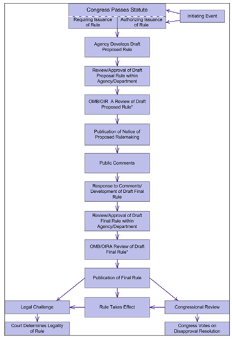 | 
|:--:| 
| *Illustration of the proposal of regulations, solicitation of comments, and finalization of rules for federal agencies (Carey, 2013).* |

---
## Web interface
The Regulations.gov website is the central hub for communication of and public comment on proposed and finalized regulations from the various federal agencies (EPA, US Forest Service, USAID, DEA, etc.). The site recently underwent a major redesign, giving it an improved UI, better search experience, and simplified commenting process (see https://beta.regulations.gov/faq?type=site). The new beta website will become the official website on February 18, 2021. 

| 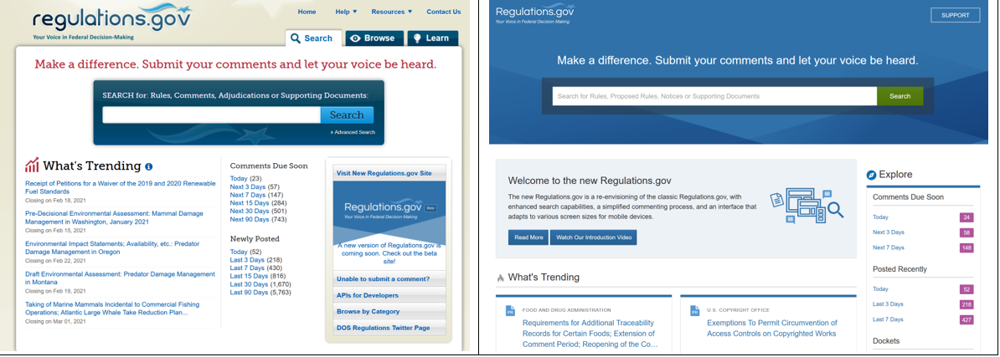 | 
|:--:| 
| *Comparison of the old Regulations.gov and the redesigned version.* |

 

Information on Regulations.gov can be retrieved via the web browser or via a public API that can be used to download information from (and [recently](https://regulatorystudies.columbian.gwu.edu/new-regulationsgov-api), upload comments to) a docket. Each docket includes a summary of the docket topic, contact information for the associated agency, various documents associated with the regulation, and a link to public comments.

|  | 
|:--:| 
| *[Docket listing](https://beta.regulations.gov/document/FWS-HQ-ES-2020-0102-0001) for a proposed rule.* |

 

There may be many public comments associated with a docket, each of which has text and/or attachments and some metadata about the commenter. The metadata are often just the commenter's name or organization, but may also include city, state, and organization type. These metadata are optional and are not verified. In addition, anonymous comments are allowed.

| 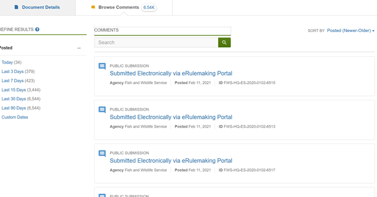 | 
|:--:| 
| *An [example listing](https://beta.regulations.gov/document/FWS-HQ-ES-2020-0102-0001/comment) of comments for one docket.* |

 

| 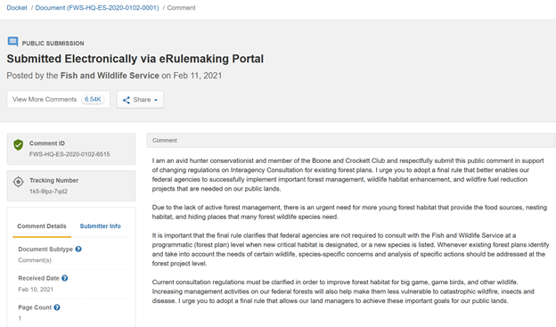 | 
|:--:| 
| *An [example of a comment](https://beta.regulations.gov/comment/FWS-HQ-ES-2020-0102-6515) for one docket.* |

 

| 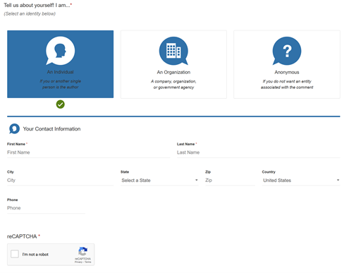 | 
|:--:| 
| *The [public comment submission form](https://beta.regulations.gov/commenton/COLC-2020-0010-0075). This shows the fields available for individuals. Only the first name and last name are required, but there is no verification of identity.* |

 

At the top of the comment submission form, the "Commenter's Checklist" gives advice on attachment file names and reasons that a comment might not be posted. Most importantly for this research, some reasons include comments that are part of a mass submission campaign, are duplicates, contain profanity, or are not related to the regulation. In addition, the site explicitly calls out form letters, saying that form letters **"do not constitute a 'vote'"** and that **"a single, well-supported comment may carry more weight than a thousand form letters."**

| 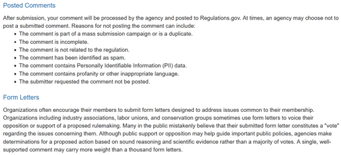 | 
|:--:| 
| *Excerpt from the "Commenter's Checklist" about reasons why a comment might not be posted and consideration around form letters.* |

 

Despite these instructions, it is common to find many identical comments for any given docket item. For example, on one docket item ("Endangered and Threatened Species: Regulations for Interagency Cooperation", [docket FWS-HQ-ES-2020-0102](https://beta.regulations.gov/docket/FWS-HQ-ES-2020-0102)), a quick search showed almost 300 public comments in support of the plan were submitted by members of the "Boone and Crockett Club" with identical or near-identical language (with a few extra words or an extra paragraph added).
 
| 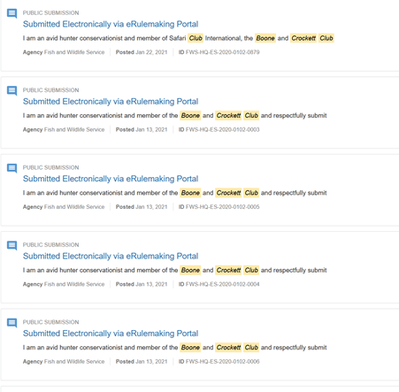 | 
|:--:| 
| *There were [almost 300 comments](https://beta.regulations.gov/document/FWS-HQ-ES-2020-0102-0001/comment?filter=boone%20and%20crockett%20club) with identical or near-identical language submitted in response to one proposed rule.* |

 

From what I have seen, these kinds of comments (which I will call "form letter comments") may be either in support of or against a proposed regulation, usually do not include attachments, and tend to be submitted by many individuals who belong to an organization and are encouraged to submit comments. Due to the lack of identity verification, it is possible that a simple bot could submit comments automatically (even given the reCAPTCHA protection on the new site). In 2017, [several](https://www.wired.com/story/bots-broke-fcc-public-comment-system/) [outlets](https://www.washingtonpost.com/news/the-switch/wp/2017/11/24/fcc-net-neutrality-process-corrupted-by-fake-comments-and-vanishing-consumer-complaints-officials-say/) [reported](https://hackernoon.com/more-than-a-million-pro-repeal-net-neutrality-comments-were-likely-faked-e9f0e3ed36a6) on over a million automated comments for and against the repeal of the FCC's net neutrality rules, and [one source](https://regulatorystudies.columbian.gwu.edu/gsa-moving-deal-mass-and-fake-comments) estimated the number near 22 million. This was also [reported in 2006](https://scholarworks.umass.edu/cgi/viewcontent.cgi?referer=https://www.google.com/&httpsredir=1&article=1001&context=erulemaking) by then UMass Assistant Professor Stuart Shulman in an article about the lack of deliberation in these open dockets (Schulman, 2006). He explains the obvious reasoning behind these tactics: "Some groups believe that overwhelming an agency like the Forest Service with form letters will result in a favorable outcome. . . .The organizational incentives combined with occasional claims of victory suggest the practice is likely to dominate the near future of electronic rulemaking." That said, a paper by the George Washington University Regulatory Studies Center concludes that, after reviewing over 1,000 mass comment campaigns on EPA rulemakings between 2012 and 2016, "there is little consistency between mass comment campaigns and the content of rules" (Balla et al., 2019).

Especially worrying, it is now within the realm of possibility that more recent NLP models, such as [GPT-2](https://openai.com/blog/gpt-2-1-5b-release/) could be used to generate novel text for each comment, making this kind of automation harder to detect. The General Services Administration (GSA) held a [public meeting](https://regulatorystudies.columbian.gwu.edu/gsa-moving-deal-mass-and-fake-comments) on this problem in 2020, and a [2019 study](https://techscience.org/a/2019121801) showed that humans were no better than random chance at discerning "deepfake" comments from human submissions (Weiss, 2019).

---
## Initial observations
Regulations.gov has comments as far back as 1952, but many (most?) of the earliest comments only include a title and submitter details. 

| 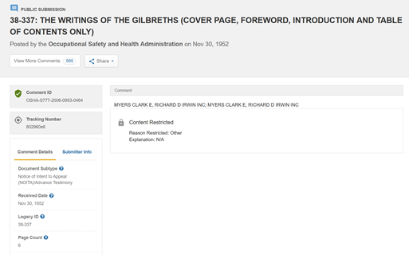 | 
|:--:| 
| *The [earliest comment](https://beta.regulations.gov/comment/OSHA-S777-2006-0953-0464) on Regulations.gov.* |

 

Some of these early comments include attachments that are journal articles related to the regulation.

| 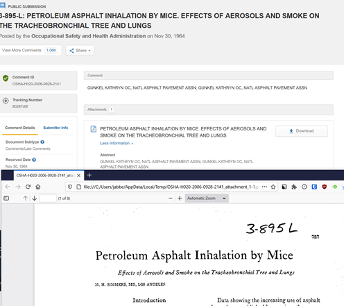 | 
|:--:| 
| *[Example](https://beta.regulations.gov/comment/OSHA-H020-2006-0928-2141) of an early comment (from 1964) with an attachment containing a journal article related to the proposed regulation.* |

 

Sometime later, comments included typewritten letters attached to the docket. Unfortunately, these typewritten comments have not been transcribed (by hand or by OCR) into plain-text and would be difficult to analyze. 

| 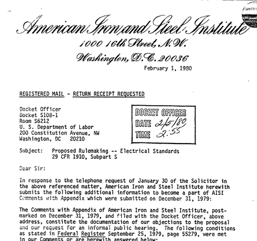 | 
|:--:| 
| *Example of a typewritten letter attached to a [public comment](https://beta.regulations.gov/comment/OSHA-S108A-2006-0686-0199) from 1980.* |

 

It is not clear exactly when public comments began being transcribed or submitted as plain-text, but some were found in the year 1999. It is clear that by this point, the general public has an opportunity to weigh in, and they clearly had strong opinions.

| 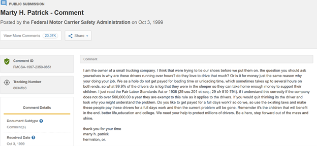 | 
|:--:| 
| *[Example](https://beta.regulations.gov/comment/FMCSA-1997-2350-0851) of a plain-text comment from 1999.* |

 

Some comments were submitted as attachments with multiple submitters, e.g., a collection of letters from the Teamsters union. This suggests that even early on, the use of form letters for public comments was common. 

| 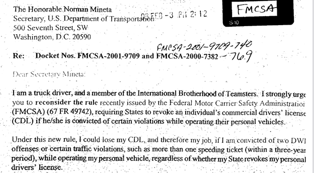 | 
|:--:| 
| *An example of a typewritten letter submitted as a collection of multiple letters from many individuals listed under a single [public comment](https://beta.regulations.gov/comment/FMCSA-2000-7382-0769-0005). All copies of the letter are the same except for the signee.* |

 

### Examples of public comments with strong opinions from 2000-2008.

 

<figure>
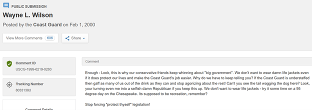
 
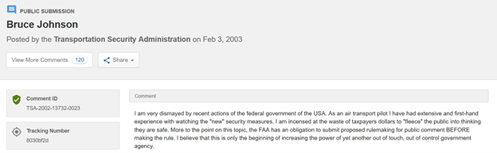
 
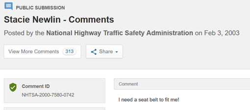
 
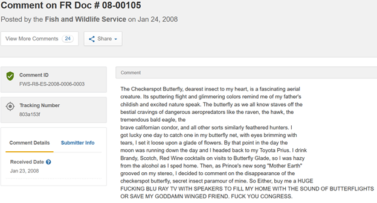
</figure>

 

---
## Research questions and ideas
Given these observations and the background described above, for the sake of this project I will be limiting my work to comments submitted on or after January 1, 2010. This is primarily for concerns of dataset size. If this proves not to be a concern, I could extend the time even further, back to January 1, 2002, which is the first year that a majority of the population of the U.S. had access to the internet according to [the International Telecommunications Union](https://www.itu.int/en/ITU-D/Statistics/Documents/statistics/2020/PercentIndividualsUsingInternet.xlsx) (ITU, 2020). 

Given the difficulty of parsing PDFs, images, and other attachments, I will also restrict my dataset to comments for which the plain-text is available. Depending on dataset size, I may need to further restrict my dataset to a smaller set of years. I do not plan on restricting comments based on agency or regulation type.

My broad research interests include the following:
* How has the total number of comments and average number of comments per docket changed over time?
* Which topics get the most comments? How does this vary over time?
* How has the sentiment of comments in each topic changed over time? Has it become more polarized (what is the balance of comments for and against)?
* Have form letter comments become more common over time? How does this vary by topic?
* Are there individuals or organizations who make very frequent comments in certain topics?

I expect there will be many issues to deal with while conducting this research, such as:
* API limits when downloading the data
* Handling duplicate and near-duplicate comments
* Text in the comments section that is not actually a comment, but is metadata (e.g., "comment unavailable" or variations on "our comment is attached")
* Spelling errors
* Comments in languages other than English
* Submitters writing a comment in response in the wrong docket
* Fake comments (though it is unclear how I would detect these)
* Comments that contain URLs

 

---
## Searching for a publicly available dataset
Before going to download the dataset myself, it made sense to see if someone else had already done it. I checked [Kaggle](https://www.kaggle.com), [Google Dataset Search]( https://datasetsearch.research.google.com), [Mendeley Data](https://data.mendeley.com), and [Data.gov](https://www.data.gov). Unfortunately, none of these searches turned up an existing dataset. 

However, a search on (regular) Google returned a [news article](https://fcw.com/articles/2011/10/05/watchdog-makes-regulations-gov-comments-searchable.aspx) from 2011 describing a 1.5 terabyte dataset from Sunlight Labs of "every current and historic docket." This seemed very promising, so I browsed through the [Influence Explorer](http://www.influenceexplorer.com) website. This proved to be another dead end. 

| 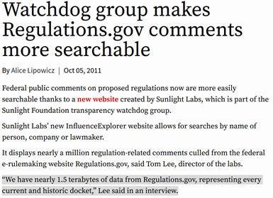 | 
|:--:| 
| *[Article](https://fcw.com/articles/2011/10/05/watchdog-makes-regulations-gov-comments-searchable.aspx) documenting the creation go the Influence Explorer.* |

 

Its parent organization, Sunlight Labs, unfortunately [shut down on November 11, 2016](https://www.propublica.org/nerds/sunlight-labs-takeover-update) (Willis, 2016). Many of their projects were moved to [GitHub](https://sunlightlabs.github.io), and hidden on an unlinked page is a [Bulk Data page](https://sunlightlabs.github.io/datacommons/bulk_data.html) with links to several datasets, including a federal regulations dataset with "approximately 13,000 regulatory dockets comprised of over 3,000,000 documents" which is "approximately 14 gigabytes" in size.

| 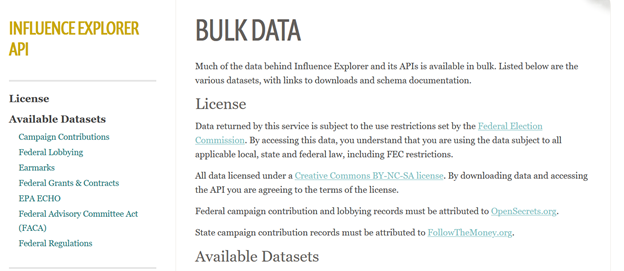 | 
|:--:| 
| *[Bulk Data](https://sunlightlabs.github.io/datacommons/bulk_data.html) page on Sunlight Labs' GitHub site.* |

 

| 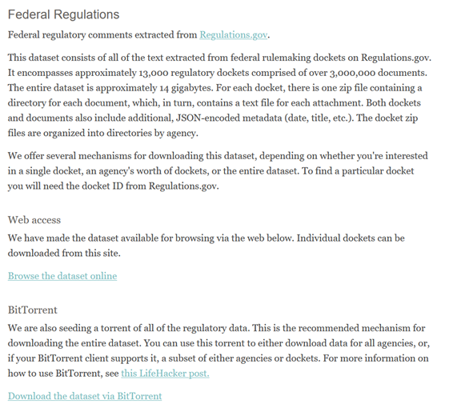 | 
|:--:| 
| *Section of the [Bulk Data](https://sunlightlabs.github.io/datacommons/bulk_data.html#available-datasets/federal-regulations) page describing their Federal Regulations dataset.* |

 

Unfortunately, all links to this dataset are broken, and while a search of the [Internet Archive]( https://web.archive.org/web/20121002000716/http://torrents.sunlightfoundation.com/browse/regulations-2011-09-27/) did produce a listing of dockets by agency, none of those links were archived. In addition, the [GitHub page](https://github.com/sunlightlabs/regulations-scraper) with code used to scrape the dockets was found, but there was no evidence of where the data might be stored.

| 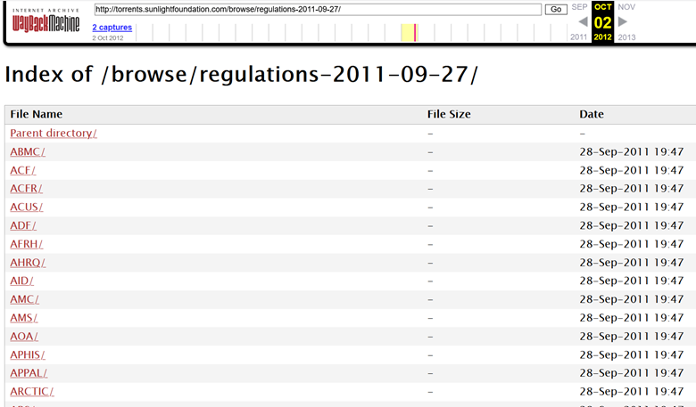 | 
|:--:| 
| *[Web archive listing](https://web.archive.org/web/20121002000716/http://torrents.sunlightfoundation.com/browse/regulations-2011-09-27) of the agencies' dockets in Sunlight Labs' extract. This capture was from October 2, 2012.* |

 

|  | 
|:--:| 
| *All links to the federal register data from Sunlight Labs' Bulk Data page, as well as links from the web archive, were broken.* | 

 

Given the lack of a current or recent dataset of public comments on the internet, it appears I will have to create this dataset on my own using the [Regulations.gov API](https://open.gsa.gov/api/regulationsgov).

 

---
## References
* Balla, S. J., Beck, A. R., Meehan, E., & Prasad, A. (2020). Lost in the flood?: Agency responsiveness to mass comment campaigns in administrative rulemaking. *Regulation & Governance*. doi:10.1111/rego.12318.
* Carey, M. P. (2013). *The Federal Rulemaking Process: An Overview* (CRS Report No. RL32240). Retrieved from Congressional Research Service website: https://crsreports.congress.gov/product/pdf/RL/RL32240.
* ITU. (2020). Percentage of Individuals using the Internet. Retrieved February 12, 2021, from https://www.itu.int/en/ITU-D/Statistics/Documents/statistics/2020/PercentIndividualsUsingInternet.xlsx.
* Lipowicz, A. (2011). Watchdog group makes Regulations.gov comments more searchable. Retrieved from https://fcw.com/articles/2011/10/05/watchdog-makes-regulations-gov-comments-searchable.aspx.
* Shulman, S. W. (2007). Whither deliberation? Mass e-mail campaigns and U.S. Regulatory Rulemaking. *Journal of E-Government*, 3(3), 41-64. doi:10.1300/j399v03n03_03.
* Weiss, M. (2019). Deepfake Bot Submissions to Federal Public Comment Websites Cannot Be Distinguished from Human Submissions. *Technology Science*. https://techscience.org/a/2019121801/.
* Willis, D. (2016, December 8). Sunlight Labs Takeover Update. Retrieved February 12, 2021, from https://www.propublica.org/nerds/sunlight-labs-takeover-update.
