# Acquiring Data from Regulations.gov

## TL;DR
Using the [Regulations.gov API](https://open.gsa.gov/api/regulationsgov/) I was able to acquire **146,916 comments** from **1,222 documents** for the period from 2011-2021. Approximately 250 documents were initially selected from each month from January 2011 to December 2020 and that set was filtered down to documents with at least 25 comments. Several issues were encountered along the way and workarounds were developed. A discussion with a programmer for the now-shuttered [Sunlight Labs](https://sunlightfoundation.com/our-work/) yielded some insights on next steps.

---
## Contents
* <a href="#datasetsearch">Dataset search redux</a>
* <a href="#api">The API and its limitations</a>
* <a href="#observations">Observations</a>
* <a href="#plan">The plan(s)</a>
* <a href="#issues">Issues encountered & workarounds</a>
* <a href="#dataset">The dataset</a>
* <a href="#advice">Advice from a (former) Sunlight Labs programmer</a>
* <a href="#nextsteps">Next steps</a>

---
## Dataset search redux
In the [last blog post](https://douglas-r-rice.github.io/jobs/firstpost/2021/02/14/1-jobs.html) I described my search for Sunlight Labs' 1.5-terabyte dataset of all data on Regulations.gov. I [reached out](https://github.com/sunlightlabs/regulations-scraper/issues/1#issuecomment-785509146) to the main software developer who worked on this project in the early 2010s to ask if the dataset might still exist somewhere. Unfortunately, he pointed out that the Sunlight Foundation (the umbrella organization) [shut down in September 2020](https://sunlightfoundation.com/2020/09/24/a-note-from-the-sunlight-foundations-board-chair/), and unfortunately, "the whole technical footprint is gone with it".

| 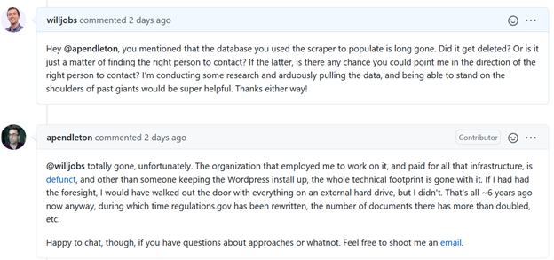 | 
|:--:| 
| *Discussion [on GitHub](https://github.com/sunlightlabs/regulations-scraper/issues/1#issuecomment-785509146) about whether [the dataset](https://fcw.com/articles/2011/10/05/watchdog-makes-regulations-gov-comments-searchable.aspx) still exists.* |

 

---
## The API and its limitations

The documentation for the [Regulations.gov API](https://open.gsa.gov/api/regulationsgov/) is quite thorough and provides examples of how to use it. It was [first released in 2012](https://sunlightfoundation.com/2013/04/09/regulations-gov-continues-to-improve-but-still-has-potential-for-growth/) and has had several major versions since then. Using it requires an API key which is immediately provided after filling out a form with one's name and email. An API key is [limited](https://api.data.gov/docs/rate-limits/) to 1,000 requests per hour, after which any calls to the API return a status code 429 error ("Over Rate Limit") until it resets the next hour. 

There are three main API endpoints:

* [https://api.regulations.gov/v4/**dockets**](https://api.regulations.gov/v4/dockets)
* [https://api.regulations.gov/v4/**documents**](https://api.regulations.gov/v4/documents)
* [https://api.regulations.gov/v4/**comments**](https://api.regulations.gov/v4/comments)

each of which returns either a listing of many of the respective items filtered according to provided criteria, or detailed information about a single item. For example, the following API call

    https://api.regulations.gov/v4/comments?filter[searchTerm]=water&api_key=DEMO_KEY

returns a JSON response with 25 comments matching the search term "water", using the API key "DEMO_KEY". In the metadata for the response, the `totalElements` attribute says that there are 1.3 million comments matching this criterion. 

 

| 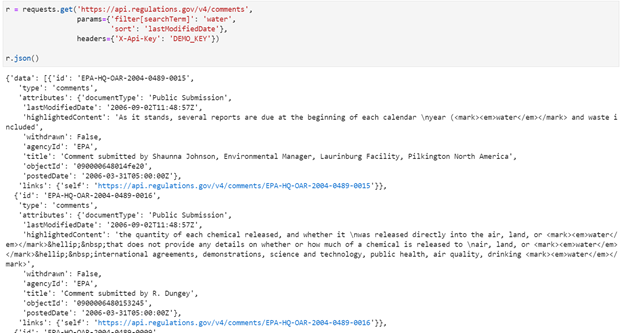 | 
|:--:| 
| *An example of the response to an API call, searching for comments with a search term of "water". The above code uses the Python requests library, but the results can also be viewed [in the browser](https://api.regulations.gov/v4/comments?filter[searchTerm]=water&api_key=DEMO_KEY).* |

 

| 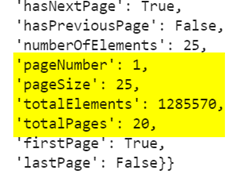 | 
|:--:| 
| *In the JSON response there are metadata indicating the number of elements matched by the request, the number of elements on each page of the response, and the total number of pages in the response.* |

 

In the example given above, the metadata in the response shows that while there are almost 1.3 million comments returned by this response, what is returned by the request is a "page" with only 25 elements and an indicator that there are 20 "pages" in the result set. This is because the API paginates responses instead of providing the data requested in bulk. Although the API is not presented as literal pages, it maps directly onto how the data are viewed on Regulations.gov (which, it turns out, uses this very same API to get its own results).

The process of getting data from the API when there are many pages is as follows:

1. Make a request as shown above.
2. That request returns 25 elements by default and metadata telling you the total number of elements in the result set. Note that the page size can be varied from 5-250 per "page" using the `page[size]` parameter.
3. To get the next page of 5-250 elements, pass in the parameter `page[number]=2` (or whichever page number).
4. Repeat this process until page 20. Note that it is important that the data are queried with a sort to ensure that subsequent requests do not return duplicates of earlier requests. Sorting can be accomplished by passing another parameter (e.g., `sort=postedDate` to sort the result set in ascending order of the date the item was posted on Regulations.gov).
5. If there are more than 5,000 elements (20 pages times 250 elements/page) in the result set, getting the next set requires using information from the last item to adjust the filter for the next set. The [example in the API documentation](https://open.gsa.gov/api/regulationsgov/#searching-for-comments-1) shows the process when sorting by `lastModifiedDate`. In this example, the previous result set's final comment's `lastModifiedDate` is used to filter the next result set with the parameter `filter[lastModifiedDate][ge]` to specify a date greater than or equal to ("ge") that date. 
6. Using that new result set, you continue back at step 3 until the full set of elements is returned.

In this example, with 1,285,570 comments returned and a maximum of 250 elements per page (which takes one request), it requires 1,285,570 / 250 = 5,143 requests to get the data. And since the API restricts users to 1,000 requests per hour, it would take **6 hours** to download this entire set of comments.

Unfortunately, this is just for a listing of the metadata about each comment. The "Detail" version of each comment, which includes the full-text of the comment, information about the submitter, and lots of other metadata, is a separate request which can only be retrieved one comment at a time. Therefore, collecting the "CommentDetail" for each of these 1.3 million comments takes 1,285,570 requests / 1,000 requests/hour = 1,286 hours = **53.6 days**.

Obviously, a limit of 1,000 requests per hour makes it next to impossible to download even a substantial fraction of the dataset at Regulations.gov. Therefore, I reached out to the eRulemaking team GSA about getting a higher rate, as recommended [on their site](https://api.data.gov/docs/rate-limits/). After several emails back-and-forth clarifying the need, they ultimately denied the request.

---
## Observations

Before deciding on next steps and how best to narrow the scope of my dataset, I thought it prudent to examine the data first. Given that I want to limit my analysis to 2011-2020, I decided to examine the `postedDate` attribute first. As to be expected, there are some spurious values, including records in year 1 and many others in the 1800s and early 1900s, which are all before the Federal Register's founding [in 1935](https://www.federalregister.gov/uploads/2011/01/fr_101.pdf). In addition, there are no dockets or documents in the system with a `lastModifiedDate` before 2006, suggesting a data migration or import around this time.

| 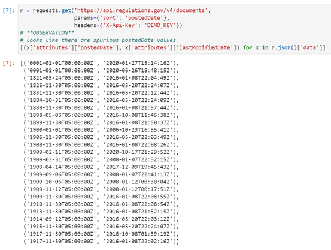 | 
|:--:| 
| *Spurious dates in the `postedDate` column.* |

 

I examined the number of dockets per year and per month to see if there were spikes at different points in the year (possibly; June and November seem to have the highest number) or if there is an observable trend in dockets over the past 15 years. It appears that starting in 2014 there was a big uptick in the number of dockets and that the final year of Trump's administration had double the number of dockets as compared to any of the first three years of his term.

| 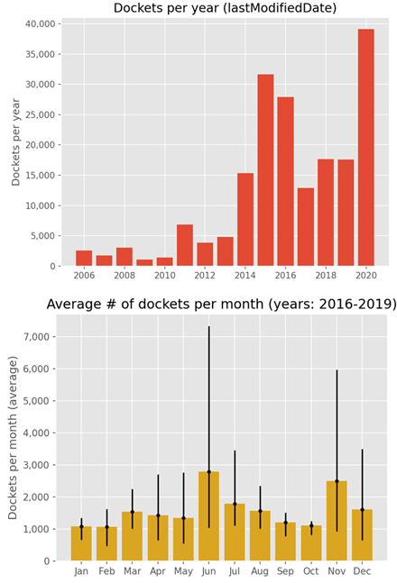 | 
|:--:| 
| *Number of dockets per year and per month (with dates determined based on the `lastModifiedDate` column). For the bottom chart the values shown reflect the average over the four years between 2016 and 2019 and the black lines show the range across all four years.* |

 

A plot of the number of comments in each year shows a spike starting around 2016 and remaining high for all four years of Trump's presidency. A plot of the average number of comments per month seemed to show a greater number of comments in the summer months than the rest of the year.

| 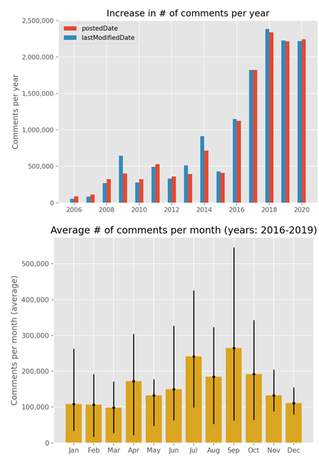 | 
|:--:| 
| *Number of comments per year, as determined by `postedDate` and `lastModifiedDate`, and average number of comments per month using `lastModifiedDate`. The black lines show the range of values for the four years across which the average was computed.* |

 

Finally, a month-by-month trend showing the total number of documents and the total number of documents associated with Rules and Proposed Rules shows a decrease in Rules and Proposed Rules since 2011 and a large surge in non-rule documents during the Trump presidency. From a cursory analysis, it appears that this spike is due to a surge in documents with a type of "Other" during the Trump presidency. It is also worth noting the big dip in both graphics at the start of 2019; this corresponds to the government shutdown of December 2018 to January 2019.

 

| 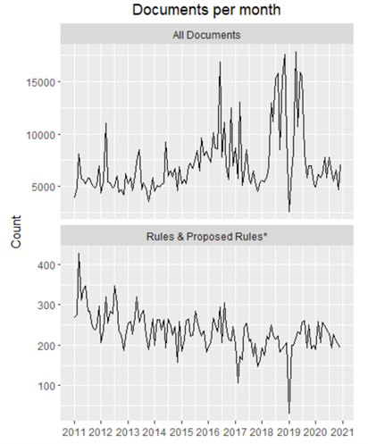 | 
|:--:| 
| *Plots of the total number of documents (top) and of documents with a document type of "Rule" or "Proposed Rule" in each month. Note the dip in early 2019: this is the government shutdown. The asterisk in the second plot title is to call out that this plot's data is further filtered to documents with a comment period (even if no comments were submitted).* |

 

| 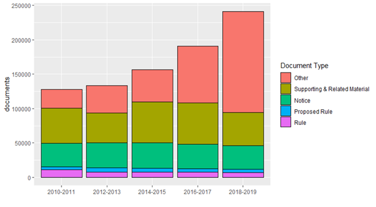 | 
|:--:| 
| *When grouping number of documents by document type over two-year intervals, it is apparent that the large increase in total documents in the 2018-2019 timeframe is due to documents with type "Other".* |

 

**Between 2011 and the end of 2020 there were**:

* 177,458 dockets
    * 38,888 in 2020 (vs. 17,580 in 2019)
* 863,574 documents
    * 74,563 in 2020 (vs. 110,684 in 2019)
* 12,160,306 comments
    * 2.24 million in 2020 (vs. 2.21 million in 2019)
    * At 1,000 requests/hour, using 1 per comment to get each comment's text, it would take **507 days** to save them all

 

---
## The plan(s)

Early in the process, I had hoped to get every comment from every document that was posted on Regulations.gov between 2011 and 2020. After determining the number of comments in that period and learning that the text of the comment is only available by querying for each comment individually rather than in bulk, I realized that this would be impossible in any reasonable timeframe. And unfortunately, while the GSA does [mention](https://api.data.gov/docs/rate-limits/) that higher API rate limits are possible, when I contacted them they said that "this particular use case presented does not constitute a rate limit increase" and that they "do not have a bulk download feature."

My next plan was to pull a sample of 1,000 comments from each year between 2011 and 2020. This would have led to a reasonable number of requests. It would have taken 4 requests for each year to get a listing of the comment IDs in each given year (because we can access 250 comments per "page", and 4 pages are needed, so 4×250 = 1,000), and 1,000 additional requests for each comment's "Detail" page, so a total of 1,004 per year or 10,004 for all years. Then, to get the information on the documents associated with each comment, the unique document IDs would be extracted from the list of comments, and each individual document's "Detail" would be requested, for another ≤ 1,000 requests per year since some of the comments sampled might come from the same docket. Then finally, the requests for each document's associated docket would be requested, and since some documents may have been sampled from the same docket, another ≤ 1,000 requests per year would be required. Altogether, this is (conservatively) about 30,000 requests total, and with a limit of 1,000 requests per hour, would entail 30 hours of downloads.

The problem with this new plan is that it would likely result in only one comment for many of the documents retrieved. This would make it impossible to assess the sentiment in each document and would probably impact other analyses.

So, the final plan was to get a sampling of 10 documents from each month in each year from 2011-2020 (120 documents per year, or 1,200 documents total), each with at least 25 comments, and collect those comments. Because there is no way to filter requests to return documents with a certain number of comments, it was necessary to first sample a larger number of documents in each month, then query for the number of comments in each document. So, a total of 250 documents (the maximum possible using only 1 request) were collected for each month from 2011 to 2020 (120 total requests, returning 30,000 documents). Then, for each of the 120 months, I stepped through the list of 250 documents and made a request for all comments associated with this document ID. I recorded the count of comments associated with the document, and if it had at least 25 comments, I downloaded up to 250 of those comment "headers" (which do not include the text of the comment). This means that, for all documents, the number of comments retrieved was between 25 and 250. Once 10 documents were found, I skipped to the next month. Finally, once all comments were retrieved, I queried for each document's "Detail" and each docket's "Detail" to get more metadata. So altogether, the sampling plan was as follows:

1. For each year and month from January 2011 to December 2020, request 250 documents (120 requests total). Documents were filtered to those that have a `documentType` of "Rule" or "Proposed Rule" and which have a non-null `commentEndDate`. This was to limit to documents more likely to have comments (the other document types, while more common, were much less likely to have comments).
2. Assign a random number to each document. Then sort the documents in order of year, month, and random number.
3. Step through the documents in the year and month, requesting the comments associated with each document's document ID. Record the count of comments for each document
    * If there are at least 25 comments for a given document, save up to 250 of the comment headers and add 1 to the count of documents retrieved for that year and month.
    * Once 10 documents with at least 25 comments are retrieved, skip to the next year and month.
4. Once all 120 documents have been identified and up to 250 comments for each have been retrieved, get the text and other metadata about each comment by requesting the "Detail" page for each comment, one at a time.
5. For each document, request its "Detail" page.
6. For each unique docket, request its "Detail" page. Note that not all documents are associated with a docket.

This approach took several days to finish because of the 1,000 requests/hour limit. The data were collected in a SQLite database for ease of querying and to ensure data integrity, e.g., by adding unique indexes on document IDs and column IDs and making it easier to confirm that each comment's corresponding document was also retrieved.

---
## Issues encountered & workarounds

In addition to the issues described above (predominantly related to the API rate limit), I encountered various other unexpected issues while attempting to retrieve the data.

### **Non-participating agencies**

While getting a sense of the number of comments and documents posted since 2011, I realized the number was far lower than I expected. Just [one proposal](https://www.federalregister.gov/documents/2017/06/02/2017-11455/restoring-internet-freedom) by the FCC generated almost 22 million comments from mass comment campaigns, according to the [Regulatory Studies Center](https://regulatorystudies.columbian.gwu.edu/gsa-moving-deal-mass-and-fake-comments) at George Washington University. When viewing this docket [on Regulations.gov](https://www.regulations.gov/document/FCC-2017-0200-0001), I found that it directs comments to the FCC's own [Electronic Comment Filing System (ECFS)](https://www.fcc.gov/ecfs/).

After some more digging, I found that there are many "independent" federal agencies that publish their documents to the Federal Register but which do not accept comments on Regulations.Gov. This list includes agencies such as the FCC, FEC, SEC, DOJ, USDA, HUD, USPS, GAO, and others. The list of participating and non-participating agencies is available at https://www.regulations.gov/agencies.

### **Inconsistency of time zone between the API and the dataset**

While iterating over a list of over 88,000 comments, around comment 30,000 I got the following error suggesting there were no more comments left to be retrieved:

| 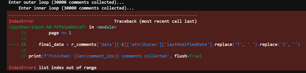 | 
|:--:| 
| *Error encountered while looping over large list of comments.* |

 

I checked the response variable itself to see how many elements it returned, and it did indeed show 0.

| 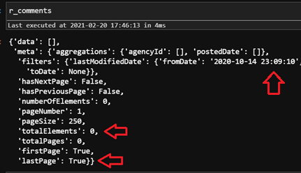 | 
|:--:| 
| *Response from API when filtering to comments after 10/14/2020 at 23:09:10.* |

 

However, when manually ordering the data in reverse to see the latest date in the dataset, I found that many comments actually occurred on October 15th:

| 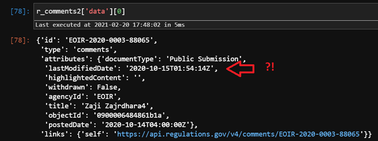 | 
|:--:| 
| *The final comment in the list of comments being retrieved. Note that its last modified date is after the filter used in the previous figure.* |

 

This suggested an issue with time zones. [It turns out](https://open.gsa.gov/api/regulationsgov/#searching-for-comments-1), while the data are stored in UTC, the filter given to the API uses the Eastern time zone, as shown in this excerpt from the API documentation:

| 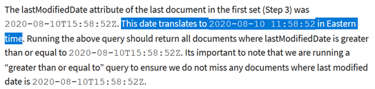 | 
|:--:| 
| *Excerpt from API documentation that innocently mentions an inconsistency in time zone handling.* |

 

### **Issues with SQLite**

While SQLite is a great single-file database, it can have some surprising gotchas. One frustrating thing SQLite does is ignore variable types; it allows any data type to be inserted into any column, regardless of its declared type. This is by design (see question 3 at https://www.sqlite.org/faq.html). In addition, when inserting data from one table into another, if you use `SELECT *` syntax (i.e., `INSERT INTO mytable SELECT * FROM myothertable`) it doesn't match data based on column names but instead on the position order of each column in its respective table. This means that you can end up putting the wrong data into the wrong columns and SQLite will be silent about it.

Another issue I encountered was while using one cursor to loop over records in the documents table, requesting the associated document's comments from the API, then inserting them into the comments table. This led to the following error:

|  | 
|:--:| 
| *Error encountered while looping over documents and inserting comments.* |

 

[It turns out](https://stackoverflow.com/a/1005218/1102199) that you can have multiple processes reading from SQLite, but if any process writes, all reads are blocked. My workaround was to read out the document IDs into a variable in Python, then iterate over the Python variable rather than the database.

### **Insufficient filters available in the API**

Because the API lacks some important filters related to comments, I needed to make many more requests to access the data I wanted. For example, there is no way to filter to documents with at least one comment, so I had to download a large number of document "headers" and then manually check each one to see which ones had comments.

| 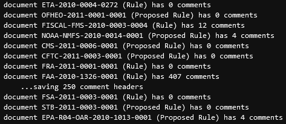 | 
|:--:| 
| *Excerpt from download process showing the process of manually requesting each document's comments to find documents with at least 25 comments.* |

 

Similarly, there is no way to filter comments to those with plain-text data, rather than just attachments like the example below. This means that it is likely that my final dataset has an unknown number of comments without any text data for me to analyze (besides the comments' metadata).

| 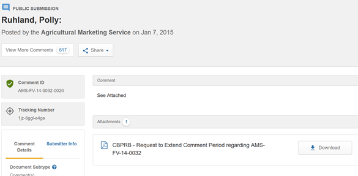 | 
|:--:| 
| *Example of a comment with an attachment but no plain-text data (other than "See Attached").* |

 

### **Workaround for API rate limits and sporadic internet hiccups**

I wrote some code that would handle the somewhat complicated request pagination while also accommodating the rate limits by waiting and retrying after a set amount of time. It was satisfying to come back and see it still working hours later.

| 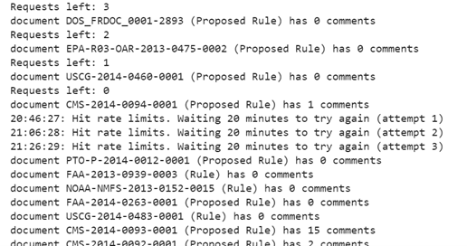 | 
|:--:| 
| *Excerpt of log output showing handling of rate limits while requesting the comments associated with individual documents.* |

 

---
## The dataset

Once collected, the dataset included:

* 146,916 comments
* 1,222 documents
* 1,101 dockets

On average there were 120.2 comments collected per document, but this is an underestimate of the true number of comments associated with these documents because I capped the number of comments collected at 250. If I had not capped the number of comments at 250, the average number of comments per document (from among the ones we sampled) would have been 1,977.3 comments per document, with a range of 25 to 223,585 comments per document.

| 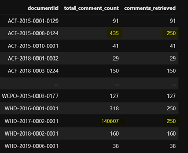 | 
|:--:| 
| *An example of documents for which we retrieved a maximum of 250 comments, though many more existed.* |

 

Note that although documents were sampled from 2011 to 2020, some comments that were retrieved were posted in 2021.

The following screenshots show the columns for each item type (comment, document, docket) and example values in each column. More information about each column can be found in [the API documentation](https://open.gsa.gov/api/regulationsgov/).

| 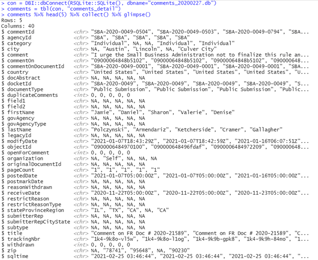 |
|:--:|
| *Listing of comment columns, types, and example values.* |

 

| 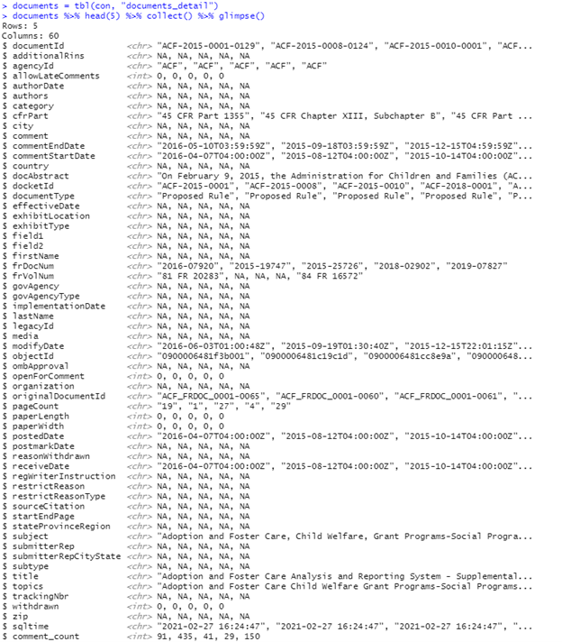 |
|:--:|
| *Listing of document columns, types, and example values.* |

 

| 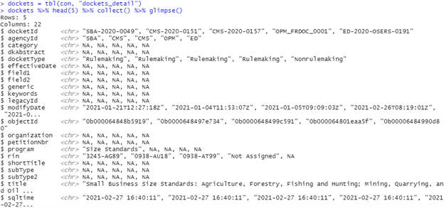 |
|:--:|
| *Listing of docket columns, types, and example values.* |

 

---
## Advice from a (former) Sunlight Labs programmer

During my email exchange with the developer from Sunlight Labs he said that sentiment analyses did not work well because comments tend to be very specific to the domain of the proposed rule. As a result, it can be difficult to determine whether a comment supports or opposed a rule. For an example, he made up a comment that could be submitted to a proposed rule related to net neutrality: "I think ISPs should be regulated as common carriers under Title II." Without context, the comment's language alone does not provide positive or negative sentiment in a way that could be generalized to comments on other topics.

Some ideas he recommended that might be worth pursuing were:

* form letter identification and clustering, as I described in the [last post](https://douglas-r-rice.github.io/jobs/firstpost/2021/02/14/1-jobs.html);
* identifying comments written by individuals, by [astroturf campaigns](https://en.wikipedia.org/wiki/Astroturfing), and by corporate submitters, which may use more formal language or legalese; and
* using named entity extraction to identify corporate submitters when that information is not contained within the metadata of the comment

---
## Next steps

Now that the data have been collected, there are several immediate next steps:

* Examining data for any obvious data quality issues. For example, identify comments with no plain-text data, or only nominal language like "See attachment."
* Examine (via plots and summary statistics) how the total number of comments per docket and total number of documents has changed by year and by month
* Summarize the data in terms of document type and government agency
* Identify individuals and organizations that make many comments
* Examine form letter comments
* Conduct corpus-related processing (tokenization, stemming, etc.)
* Investigate what is causing the spike in "Other" documents in the Trump presidency
