# Characterizing the public comments dataset

The goal of this post is to dive deep into the data and characterize the comments at a high level.

---
## Contents
* <a href="#reminder">Reminder about sampling</a>
* <a href="#comments-per-doc">Comments per document</a>
* <a href="#comment-length">Comment lengths</a>
* <a href="#attached">Attached comments</a>
* <a href="#most-commented">Most-commented agencies</a>
* <a href="#duplicates">Duplicates and form letters</a>
* <a href="#frequent-submitters">Frequent submitters</a>
* <a href="#parsing-corpus">Parsing the corpus</a>
* <a href="#trade-war">Bonus: trade war!</a>

---
## Reminder about sampling

In the last blog post I described [the sampling plan](https://douglas-r-rice.github.io/jobs/2021/02/28/2-jobs.html#plan). Below is a visual summary (not to scale). The pie chart summarizes some of the findings to be described later in this post. Note a few things:

* The sampling scheme starts at the "document" level (i.e., the item posted by the government on which the public can comment) before collecting comments. This was to ensure I had multiple comments from each document, rather than many documents each with only one comment.
* The selection of 250 documents per month (second row) and 250 comments per document (fourth row) are due to the design of the API. I could retrieve a maximum of 250 items with a single request, so it was convenient to select exactly 250.
* In the third row I end up with 1,222 documents rather than 1,200 (10 documents per month times 12 months times 10 years). This is because I had to restart the download process on the year 2018 and the API returned a different set of documents the second time. Rather than cull the dataset down to exactly 1,200 documents, I kept the extras.
* While I got 146,916 comments from these 1,222 documents, many of these documents had far more than 250 comments. In fact, had I downloaded all of the comments associated with these documents, I would have downloaded another 2.3 million comments.

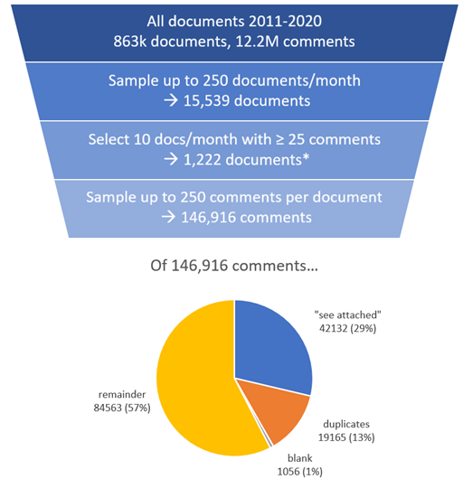

---
## Comments per document

The number of comments per document was very right-skewed. When including documents for which I got the count of comments but not the comments themselves, over half of the documents have zero comments, and the range of comments is from 1 to 223,585 comments for a single document. However, if I limit the analysis to just the documents for which I collected comments and used the count of those comments (which is capped at 250, rather than the document's actual number of comments), the range is from 25 to 250 comments, and about a quarter of the documents were capped at the maximum of 250 comments.

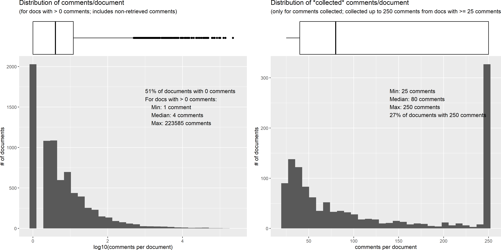
 

Among all observed documents, there tend to be a small number of comments per document in any given year (the third quartile is typically under 15 documents and the median is 5 or fewer in all 10 years observed). Because comments were collected only for documents with 25 or more comments, the distribution of comments per document among those collected is much higher: the median in any year is over 10 times as large as among all documents, and in the five most recent years the third quartile hit the maximum of 250 comments per document.

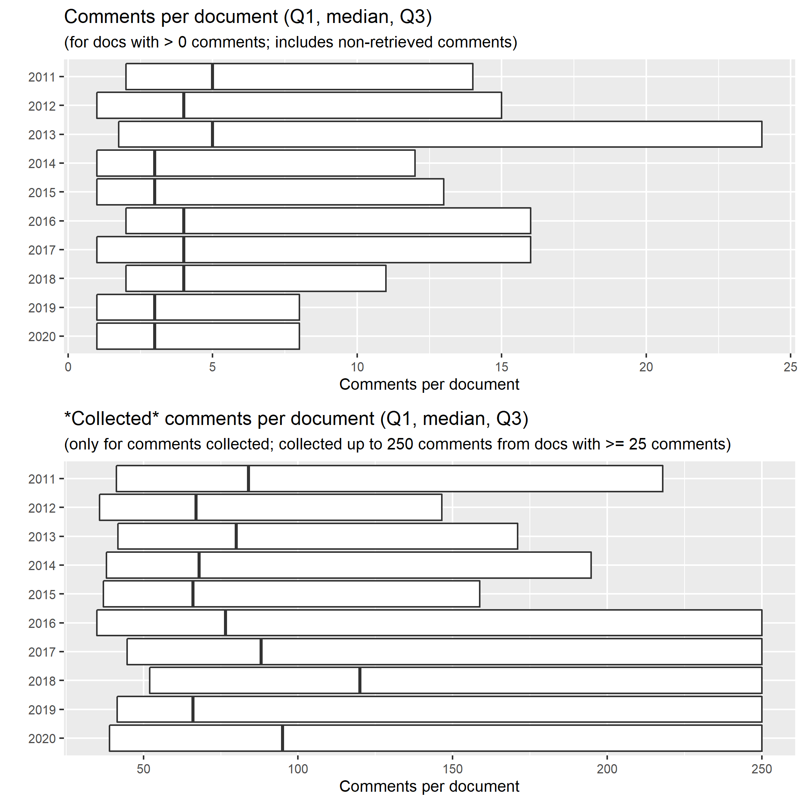

---
## Comment lengths

The distribution of comment lengths (and the log-transformation) is shown below. As with the number of comments, the comment lengths are very right-skewed. The shortest comment is 0 characters (blank), the shortest non-blank comment is 1 character, and the longest comment is 15,975 characters (a very rambling comment). Note that 1,056 comments are blank (0.7% of full dataset).

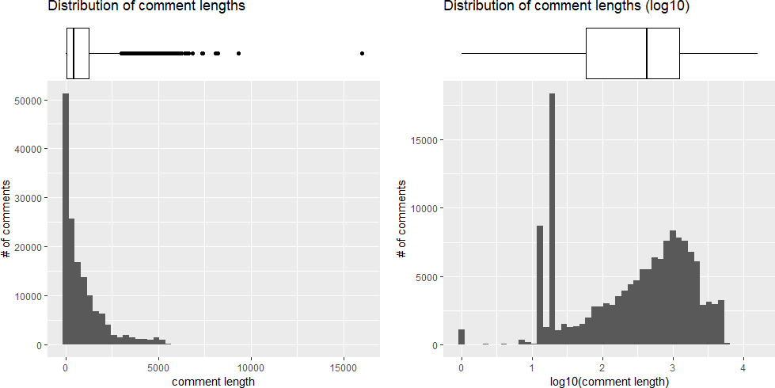

The log-transformation, it turns out, was very helpful for spotting an anomaly in the data. What is causing those spikes at (it turns out) 12 characters and 20 characters? 

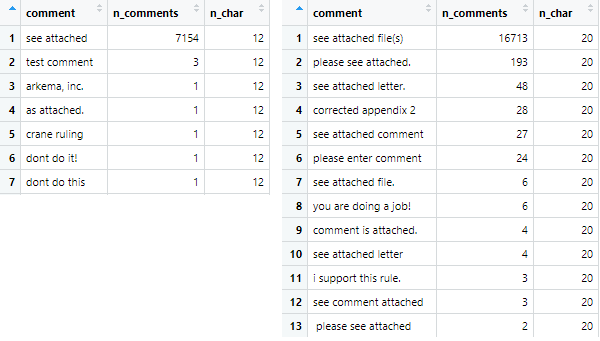

---
## Attached comments

A not insignificant amount of comments consists of some version of "see attached". However, not all comments indicating a file was attached are quite as brief: 

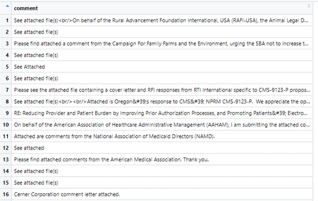

Therefore, I decided to flag "attached" comments as those matching the following filter: `^attach(ed|ment)|[^\\-a-zA-Z0-9]attach(ed|ment)`

The remaining comments, which I call "non-attached" comments, are likely to have more information than these "attached" comments, and I may focus analysis on these non-attached comments. This comes at the loss of 42,132 comments (28,7% of the dataset). There are some false positives matched by the filter (e.g., the filter would match the phrase "I have grown attached to this regulation"), but I did not see many such cases.

The distribution of comments per document for only the "non-attached" comments is given belong, alongside the number of comments per document in each year.

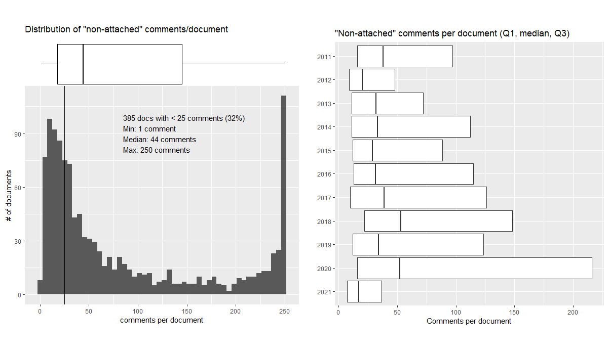

The boxplots below show the interquartile range of the length of the comments for the "attached" and "non-attached" comments. This aligns with the hypothesis that the non-attached comments would have more information.

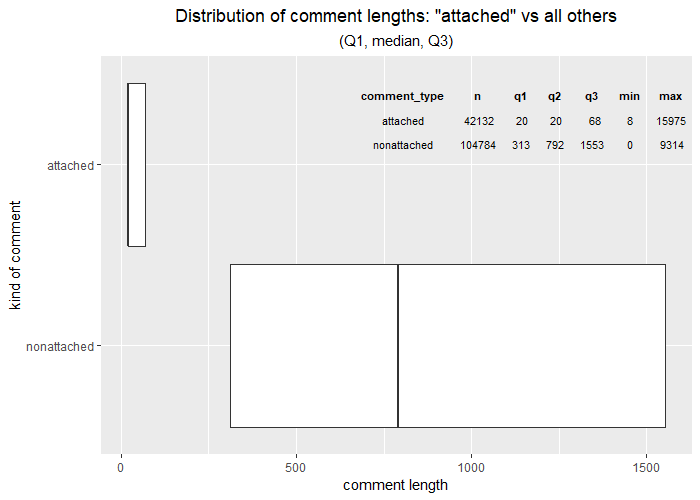

Finally, after pulling out the attached comments, we can confirm that there is no longer a spike in the distribution of comment lengths at 12 or 20 characters:

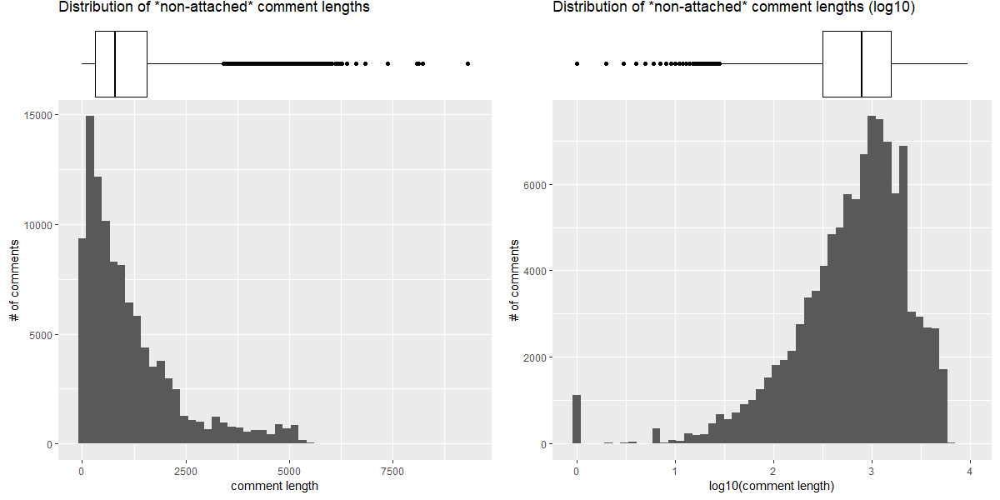
 

---
## Most-commented agencies

Of all 107 federal agencies whose comments I collected, the following nine agencies had the highest number of comments received in the ten-year period from 2011-2021. This includes both attached and non-attached comments.

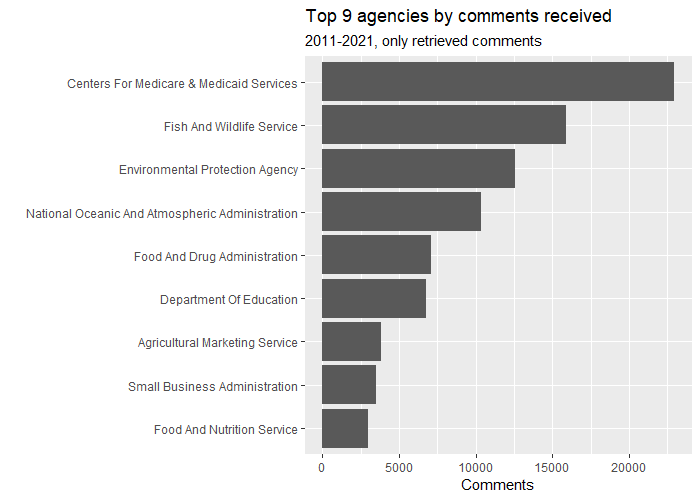
 
The distribution of comments over time for each of these agencies is shown below.

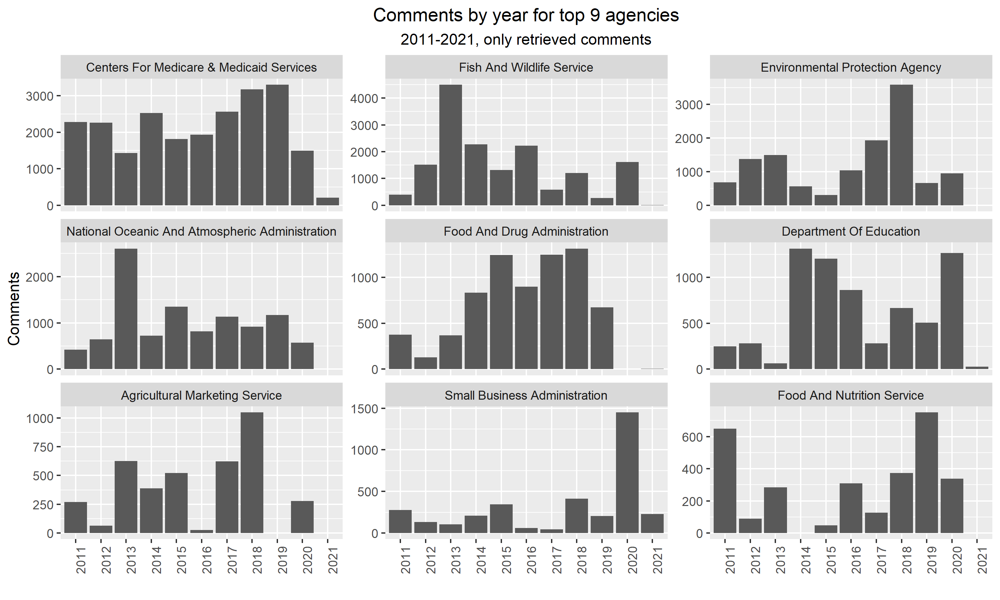
 
Two key insights from this graphic are:

* The spike in Small Business Administration comments in 2020 is due to the Paycheck Protection Program
* There are no FDA comments in 2020 (in this dataset) because there were only 25 "Rule" and "Proposed Rule" documents in that year and only a subset of them had at least 25 comments, so it was highly likely that my sampling algorithm would miss those documents.

---
## Duplicates and form letters

One of the main research questions of this project is the prevalence of form letter comments submitted to the Federal Register. As a first, very rough estimate, I grouped comments by the comment text (actually, by the "hash" of the comment text for speed). The non-attached comments consist of 86,369 unique comments, and 1,806 of them have at least one exact duplicate. These duplicates taken together comprise 19,165 comments: 13% of all comments collected and 18% of the non-attached comments. The most frequent comment was "Comment" which occurred 306 times in the dataset.

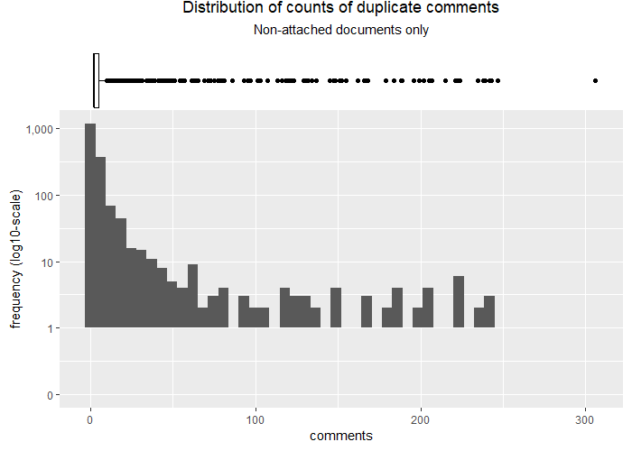

Recent years show an uptick in these duplicate comments, suggesting an increase in form letter campaigns.

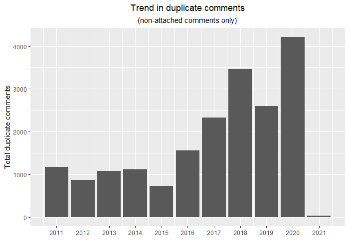
 
Finally, there are some agencies with higher rates of duplicate comments than others:

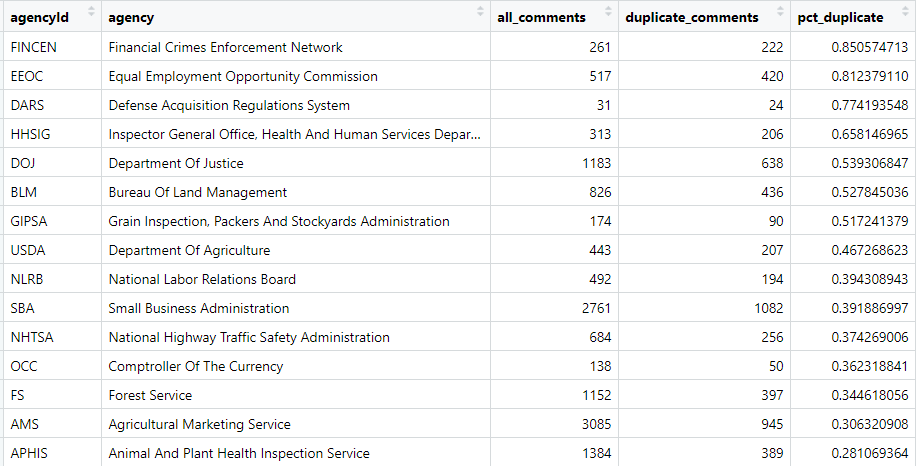

---
## Frequent submitters

Related to the concept of duplicate comments is the idea that there may be individuals or organizations submitting comments frequently and on certain topics. Before calculating counts I lowercased all names and combined the first name and last name into a single field.

Some of the most common individual submitters were:

* Missing/NA (58,783; 40%)
* Some form of "anonymous" (anonymous anonymous (6,076), john anonymous (12), etc.) (4.7%)
* Any two single letters ("c c" (95), "x x" (40), etc.)
* "multiple submitters" (34)
* [redacted] [redacted] (15)
* Some individual names: "jean public" (64), "jean publieee" (23), "christopher lish" (40), "jim greenwood" (27)

Some of the most common organizations were:

* Missing/NA (120,621; 82%)
* "na" (781), "none" (482), "n/a" (61)
* "private citizen" (1,019), "citizen" (275), "public citizen", "personal", "concerned citizen", "american citizen", "private", "private individual", "self" (201), "individual" (115), "myself", "mr.", "mrs.", "ms.", "retired" (39)
* american commitment (227)
* american civil liberties union (200)
* american atheists (140)
* princess anne middle school (101)
* center for biological diversity (74)
* "ferrellgas" [sic] (69)
* murray state university (57)
* usaid (49)
* the pew charitable trusts (44)
* defenders of wildlife (42)

I thought it worthwhile to look at the comments for a handful of these frequent submitters.

### Jean Publieee

I was curious about why this individual's name so high in the list of frequent submitters, especially since it appears that their last name probably has a typo. Pulling a sampling of comments, it seems the individual has very strong opinions and they comment on a variety of topics.
 
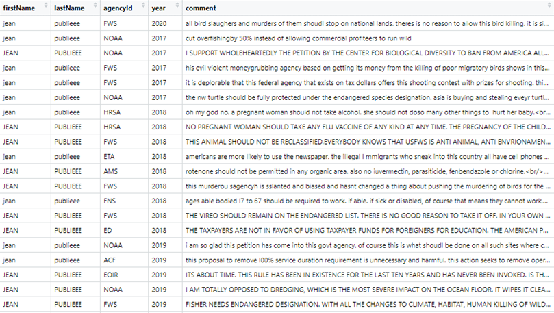

### The Pew Charitable Trusts

The Pew Charitable Trusts tends to attach files with hundreds or thousands of comments at a time. One comment even had an attachment with over 63,000 individuals urging NOAA to complete an environmental impact analysis before opening a year-round closed area to commercial fishing. Pew is a nonprofit NGO whose [policy areas](https://www.pewtrusts.org/en/about/mission-and-values) are "public opinion research; arts and culture; and environmental, health, state and consumer policy initiatives."

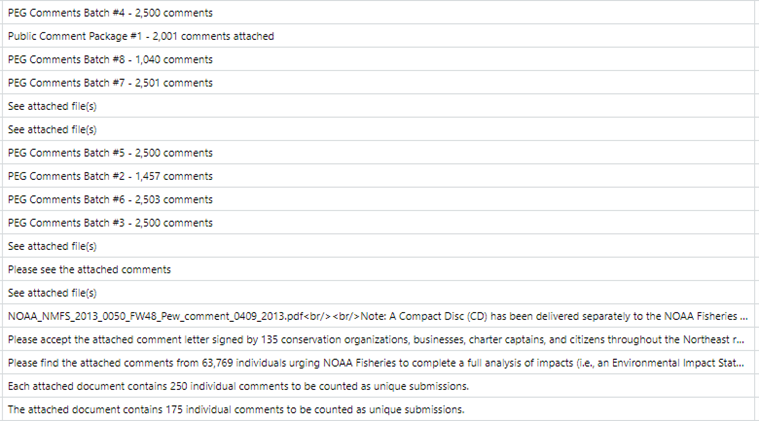

### American Civil Liberties Union (ACLU)

Of 201 comments submitted, 196 were in response to one proposed rule by the Department of Justice to require sampling DNA from immigrant detainees, and from anyone who is arrested, facing charges, or convicted by a federal agency.
 

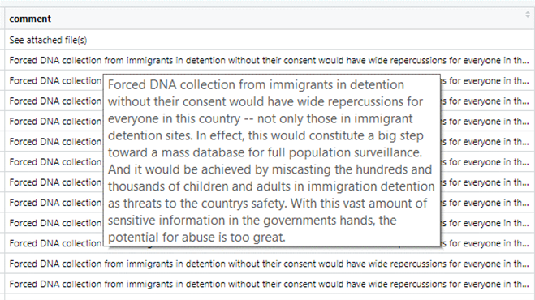

### American Atheists

Of 139 comments, all but seven are in response to a change to the Paycheck Protection Program allowing wealthy religious organizations to apply for aid that is meant for small businesses, even if they would not have been able to qualify were they a non-religious organization. There appear to be thousands of such comments with the same text in the docket, but I only collected 250. Of the 250 I collected, all but three have exactly the same text.

 

### Princess Anne Middle School

My favorite surprise on the frequent submitters list was this middle school in Virginia. After examining the comments, it is clear that these 102 comments were submitted by a seventh grade life science class in 2014 writing in opposition to a proposal to remove the Delmarva Peninsula Fox squirrel from the Endangered Species list.

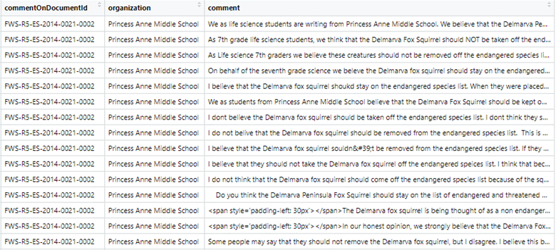

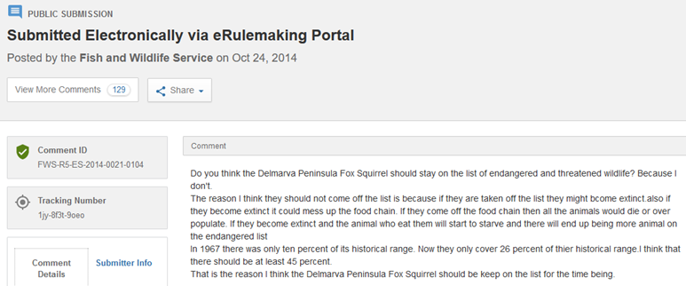

|  | 
|:--:| 
| *Image from https://commons.wikimedia.org/wiki/File:Sciurus_niger1.jpg* |

---
## Parsing the corpus

Using Quanteda, I created a corpus of all comments, using each comment as a "document" in the corpus. In the future I might also try concatenating all comments for a given document into a single string so that a government document is the "document" in the corpus. The number of sentences per comment (for non-attached comments) is shown below. Notice its strong similarity to the distribution of comment lengths. Comments that are listed with a very large number of sentences often the result of a comment including a list of citations or references to court cases.

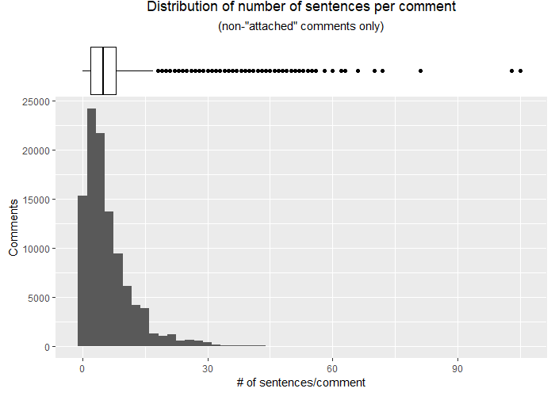

The top 9 most-commented agencies' interquartile range of sentences per comment is shown below. There was no discernible difference among the agencies.

I had a hypothesis that documents receiving many comments would tend to have shorter comments (in terms of number of characters and number of sentences) because more of the public would be chiming in with short sentences stating their support or opposition, while comments with fewer comments would attract a niche audience which would write more detailed comments. However, I did not find evidence in the data to support this hypothesis:

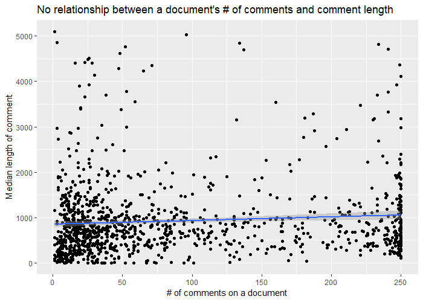

I also calculated the Flesch-Kincaid readability scores, but for some reason I don't understand, the readability scores were largely meaningless, ranging from the [theoretical minimum](https://en.wikipedia.org/wiki/Flesch%E2%80%93Kincaid_readability_tests#Flesch%E2%80%93Kincaid_grade_level) of -3.4 to a maximum of 563.

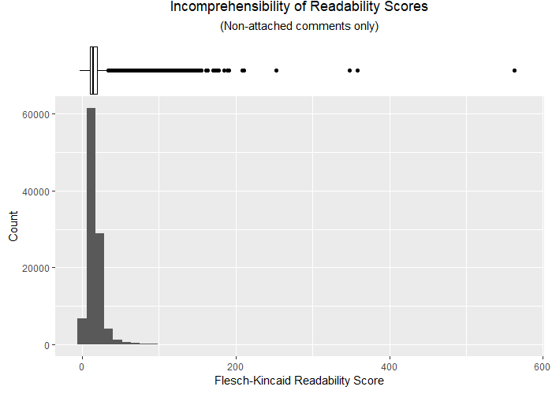

### Top features

After creating a document-feature matrix (DFM) for all comments and for only non-attached comments, removing punctuation and English stop words, I examined the top 20 features. At the top of the list were HTML-related characters and tags:

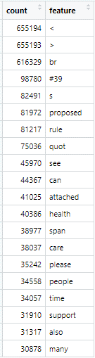

Thus, I went back and used the `rvest` package to strip out the HTML tags and entities (e.g., `#39;` for a single quote or `&amp;` for an ampersand). Then I re-ran Quanteda's `dfm` function, this time removing English stop words, symbols, numbers, and URLs before examining the top features. Below is a comparison of the top 50 features (and counts) for all comments and for just the non-attached comments. The list contained 56 entries because I included the union of the two top 50 lists. Notice that four tokens are missing from the non-attached list: "see", "attached", "file", and "s" (as in "see attached file(s)").

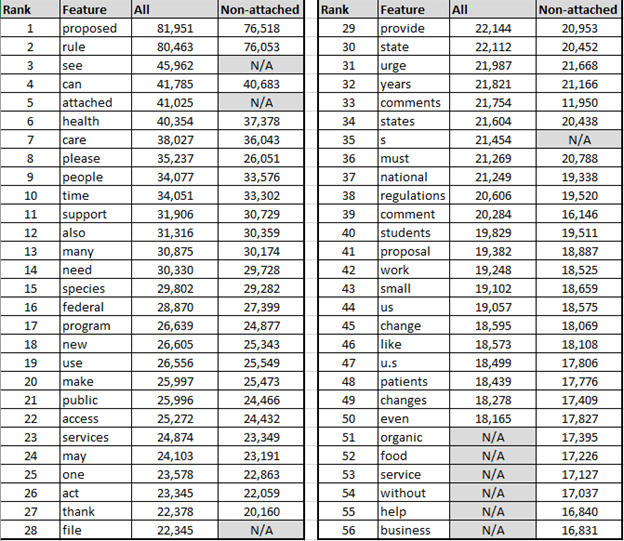

### Word clouds

Using these updated corpora I made word clouds for all comments and for the non-attached comments only. The word clouds were limited to features in at least 5% of documents but in no more than 30% of documents.

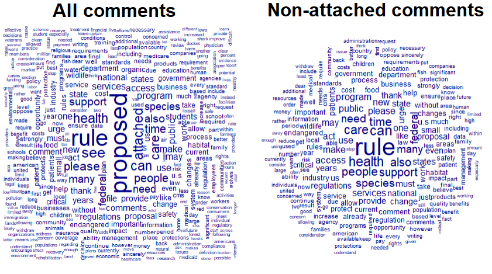
 
Finally, I made a word cloud  for each of the top 9 most-commented agencies. Notice that the word clouds do a decent job in each of identifying topics that would reasonably be associated with each agency. For example, the Centers for Medicare & Medicaid Services includes words like "patient", "physician", and "insurance"; the Food and Drug Administration includes the words "tobacco", "nicotine", and "labeling"; and the Environmental Protection Agency includes words like "water", "pollution", "air", and "emissions".
 
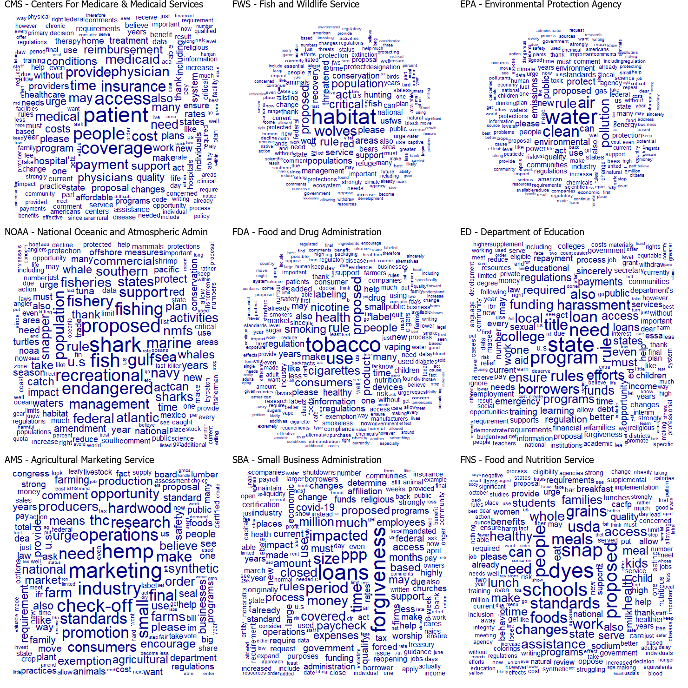

---
## Bonus: trade war!

In the last post [I mentioned](https://douglas-r-rice.github.io/jobs/2021/02/28/2-jobs.html#observations) that if you plot the number of documents by year from 2010-2019 and group the documents by document type you can see a marked increase in the total number of documents in 2018-2019 entirely driven by an increase in the "Other" document type category. At the time I had no explanation but was curious so I downloaded the header information for all 361,457 documents with the "Other" document type in that time window. The first thing I did with this data was to group it by "subtype", an optional field that agencies can use to further categorize a document, and grouped the data by year, resulting in the following visualization:

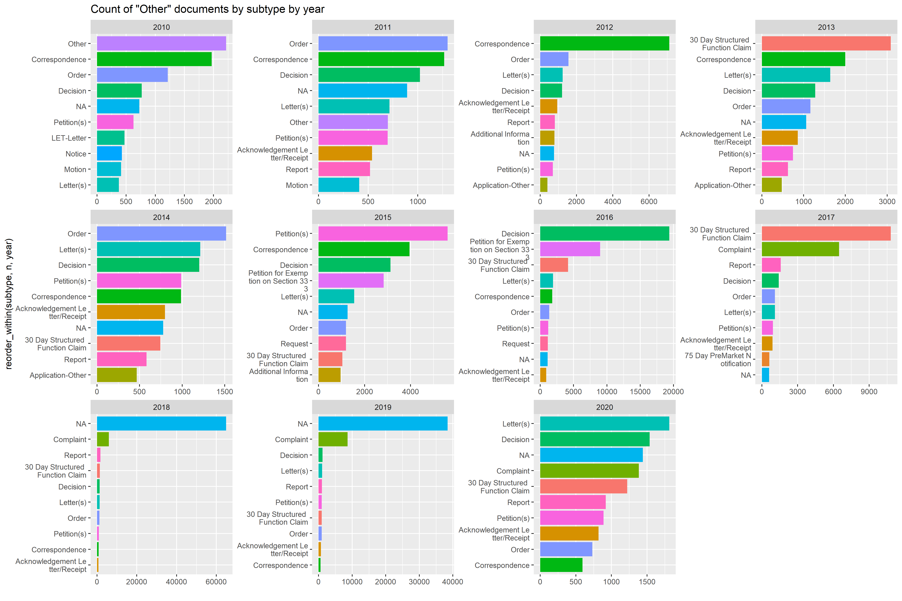

Or, if you're more into seeing this animated: 

Clearly, the spike in 2018 and 2019 is driven by "Other" documents with a missing (NA) subtype. Mysterious.

At this point it was worth looking at the titles of some of these Other-NA documents. I quickly noticed that most of them began with the capitalized words "EXCLUSION GRANTED", and less commonly, "EXCLUSION DENIED". In fact, of the 103,345 documents with an NA subtype in 2018 and 2019, 99,298 of them (96%) begin with the word "exclusion", and exclusions happened only in 2018 and 2019 during which time they accounted for 73% and 61% of all comments in those years, respectively. When these "exclusions" wee removed from the dataset, the total number of "Other" comments in 2018 and 2019 is similar to previous years.
 
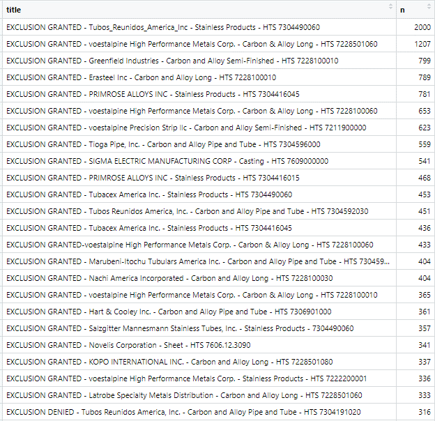

Of the 103k exclusions, around 86k were associated with documents published by the Bureau of Industry and Security (BIS) and another 14k were associated with documents published by the United States Trade Representative (USTR). Counting the "EXCLUSION GRANTED" and "EXCLUSION DENIED" documents separately, the BIS documents were 70.4% "EXCLUSION GRANTED" while the USTR documents were only 34.4% "EXCLUSION GRANTED" documents.

Looking at individual comments, I found that these were associated with companies seeking special exceptions for their companies to get around tariffs associated with the Trump Administration's trade wars in 2018 and 2019.

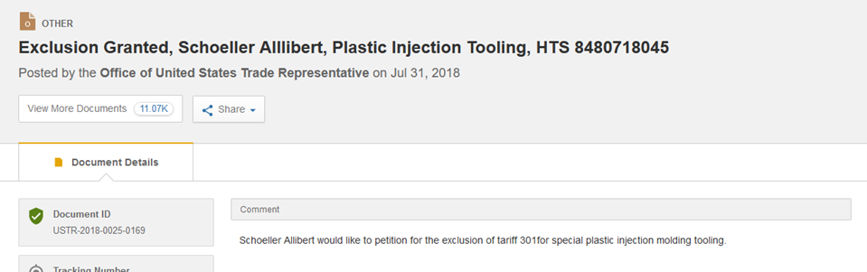
 

These comments usually included a standard request form like the following:
  
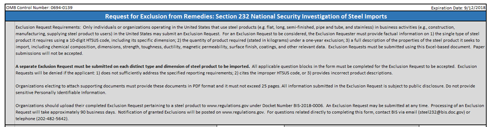

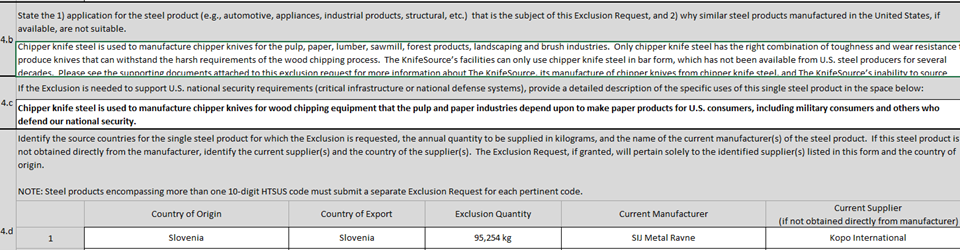
