# Assessment of Polarity and Similarity in Public Comments

In this post I will discuss how I used a dictionary approach to assess the polarity of public comments. This approach was limited by the wide range of topics in the dataset, the various ways people may indicate support or opposition to a proposed regulation, and the distinction between emotional valence and position on an issue. I will also cover my efforts to use measures of similarity to begin to identify form letter comments that are similar, but not identical. In the next post I plan to use the similarity dataset I constructed to build a supervised learning model to identify form letter comments.

---
## Contents
* <a href="#dictionary">Polarity via dictionary</a>
    * <a href="#dictionary-agency">Agency-specific polarity</a>
    * <a href="#dictionary-lengthyear">Comment polarity vs. comment length and year</a>
    * <a href="#dictionary-validation">Validation of the dictionary approach</a>
* <a href="#same-time">Comments submitted at the same time</a>
* <a href="#similarity">Comment similarity</a>
    * <a href="#cosine">Cosine similarity</a>
    * <a href="#additional-measures">Additional measures of similarity</a>
* <a href="#where-next">Where next?</a>
* <a href="#bonus">Bonus: bots!</a>

---
## Polarity via dictionary

I used three dictionaries contained in the R library [`quanteda.dictionaries`](https://github.com/kbenoit/quanteda.dictionaries) to measure sentiment of comments in the public comments corpus:

1. The Augmented General Inquirer *Positiv* and *Negativ* dictionary ("Gen. Inq.") ([(Stone, Dunphy, and Smith, 1966)](https://psycnet.apa.org/record/1967-04539-000)
1. The NRC Word-Emotion Association Lexicon ("NRC") [(Mohammad and Turney, 2013)](https://arxiv.org/abs/1308.6297)
1. The Affective Norms for English Words dictionary ("AFINN") [Nielsen, 2011](https://arxiv.org/abs/1103.2903)

I calculated polarity the same way for all three dictionaries. First, I created a document-feature matrix (DFM) from the [non-attached comments corpus](https://douglas-r-rice.github.io/jobs/2021/03/14/3-jobs.html#attached), lowercasing all words and removing punctuation (but not stemming). I then calculated polarity as the difference between the number of "positive" and "negative" terms (as defined by the dictionary), normalized by the sum of these terms. The distribution of comment polarities is shown below for each dictionary. It is reassuring that all three dictionaries show the same pattern; for this reason, in subsequent analyses I used only one dictionary, NRC (arbitrarily-chosen).

 

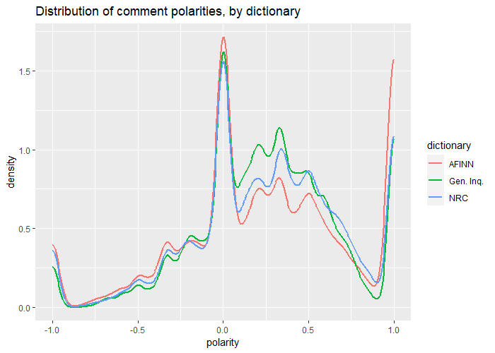

 

### Agency-specific polarity

I was curious about whether some agencies elicited a more positive or negative set of comments than others, so I summarized the comment polarities by agency. While this summary isn't normalized by the number of comments each agency received, some of the findings are interesting. Many of the agencies with the highest average polarity are agencies that provide support or services to citizens, in areas such as labor (e.g., the National Labor Relations Board), parks and natural resources (Department of the Interior, Forest Service, National Park Service), and health (Indian Health Service, Inspector General for Health and Human Services, Centers for Medicare & Medicaid Services). By contrast, some of the most negative polarities are associated with agencies that enforce federal regulations, such as the Equal Employment Opportunity Commission; the Drug Enforcement Agency; the Financial Crimes Enforcement Network; and the Alcohol, Tobacco, Firearms, and Explosives Bureau. Surprisingly, the IRS, an oft-maligned federal agency, received an almost neutral overall average polarity.

 

| 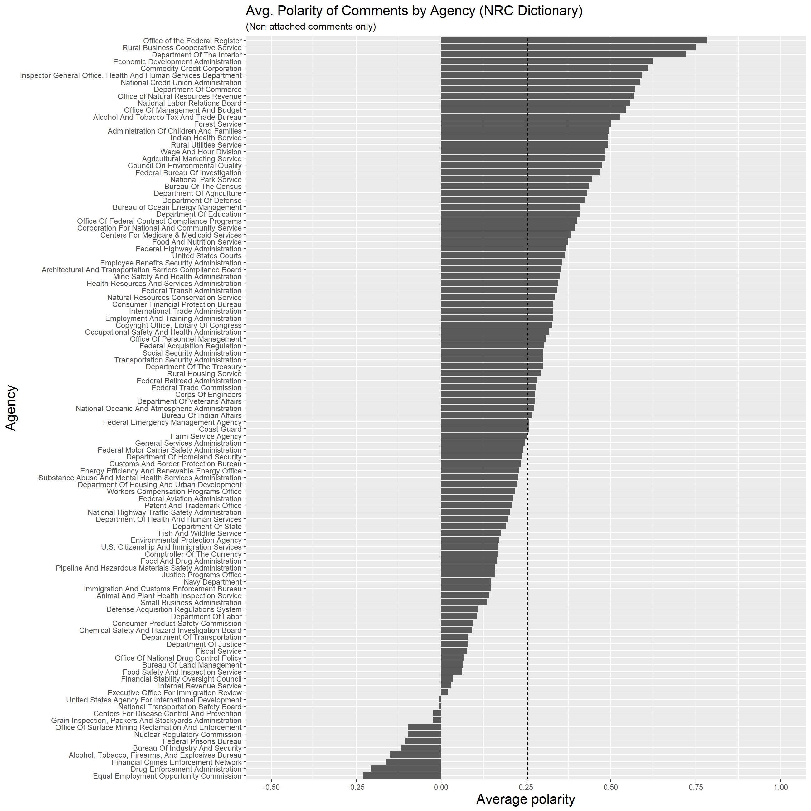 | 
|:--:| 
| *Mean polarity of non-attached comments, by agency, using the NRC dictionary. Vertical dashed line indicates the overall average polarity across all comments.* |

 

To see how these findings held up across dictionaries, I examined the rankings given by each dictionary for the most polarized agencies. A rank of one corresponds to the most positive polarity. The figure below shows that even though all three dictionaries give the same overall sentiment score across all comments (between 0.25 and 0.26), they can sometimes give very different rank orderings to the agencies.

 

| 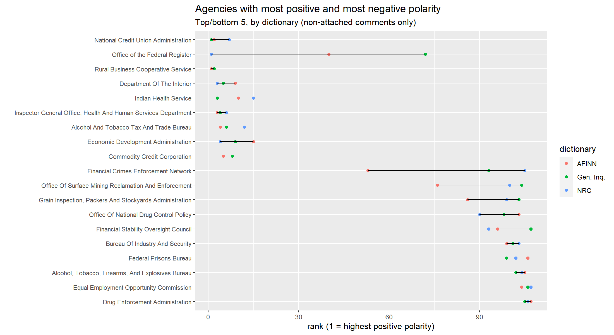 | 
|:--:| 
| *Examination of how the three dictionaries differed in their rankings of the top 5 and bottom 5 (by polarity) agencies. There are 19 agencies in the figure because the top 5 and bottom 5 from each dictionary were combined to make the full list. The horizontal line shows the range of rankings across the three dictionaries. The agencies are sorted in this list by the highest rank (1 = highest possible) given by any of the three dictionaries.* |

 

Because I am primarily interested in overall trends and the dictionaries agree on the overall average, I decided to continue using the NRC dictionary for the following analyses.

To understand more about how and why these agencies differ in polarity, I estimated the polarity of the context around the top 20 tokens for each of the top 9 most commented agencies. For each agency I created a new DFM based on its non-attached comments, removing punctuation, English stopwords, symbols, numbers, and URLs. Then I extracted the top 20 terms (by document frequency) and extracted a window of 40 tokens on each side of these tokens. Finally I calculated the polarity of all of these tokens for each comment using the method described above and created the plot below. All of these agencies have an above-average polarity overall, except the EPA, and they have left-skewed distributions (i.e., a long tail on the left with most of the mass towards the positive polarities).

 

| 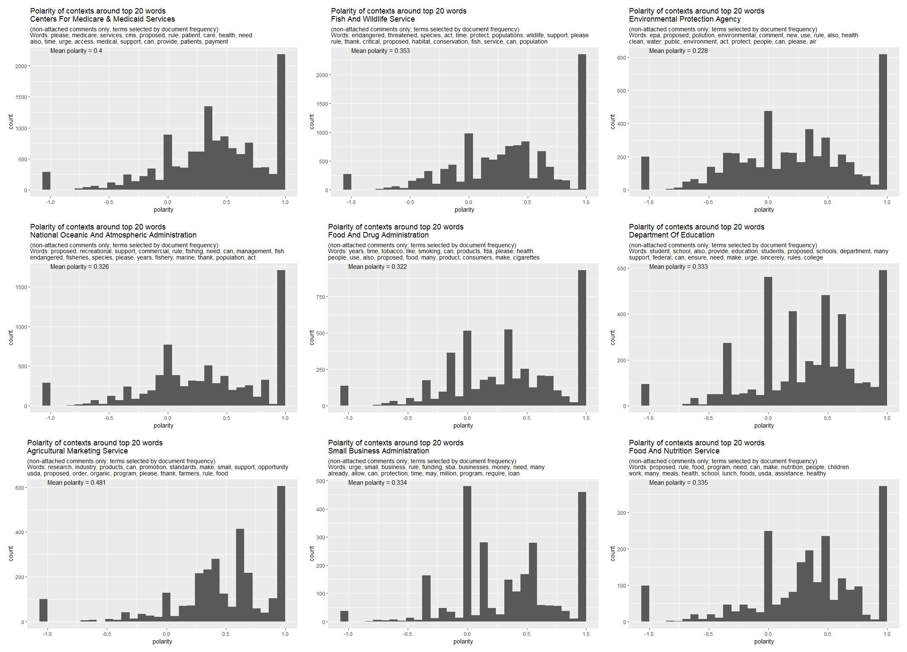 | 
|:--:| 
| *Polarity of the context surrounding the top terms for each of the top 9 agencies* |

### Comment polarity vs. comment length and year

Next, I investigated whether comment polarity was at all correlated with comment length or comment year. With regards to comment length, I hypothesized that there might be a bimodal effect, where very short comments and very long comments have more extreme polarities, and comments with a length in between might have a more neutral polarity. I would expect this to appear as greater variance at the low and high end of comment lengths (as more comments are spread across the full range of polarity) and less variance at the middle comment lengths. However, as the figure below shows, I did not see such an effect; if one exists, the visualization does not make a convincing case of it.

 

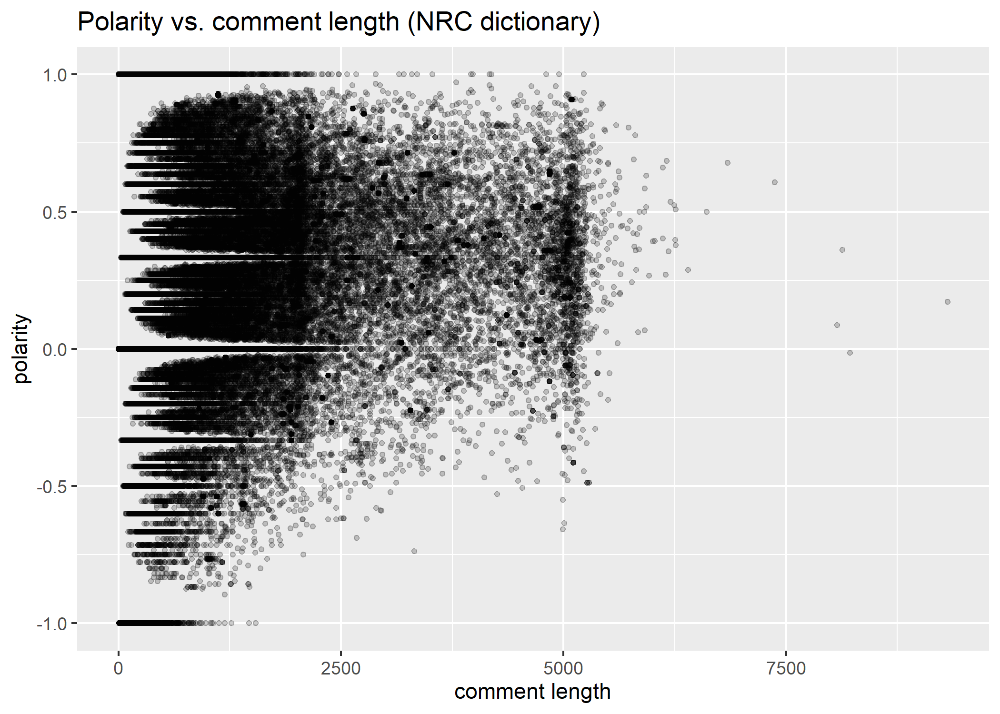

 

Similarly, I did not see a trend in comment year. Note that 2021 has a different pattern than the rest because the dataset has far fewer comments posted in 2021.

 

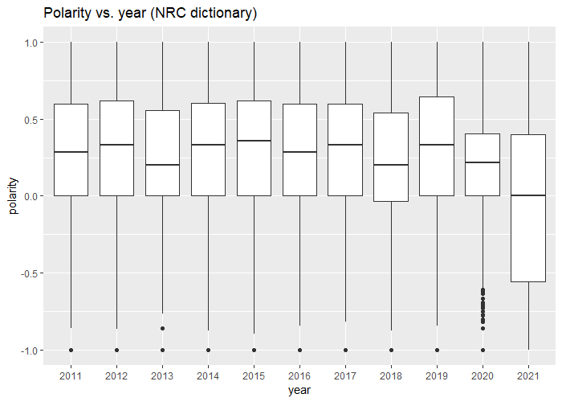

 

### Validation of the dictionary approach

To validate the dictionary approach on this dataset I examined the comments associated with very high (+1.0), very low (-1.0), and near-zero polarity. I found that on short comments with clear, unambiguous language, such as "I vehemently oppose this change", the polarity metric is what one would expect (in this case, very negative). 

However, there are several ways that the polarity metric fails. For example, there are many cases where a comment with strong language had a near-zero polarity, such as: "I am completely opposed to any expansion of federal funding (my tax dollars) for factory farms. In fact I would like to see all funding to factory farms curtailed." The metric also appears to assign positive sentiment towards statements like "Thank you for this opportunity to comment." Sarcasm also causes the dictionary approach to stumble, as in comments like "Nice one" and "Have you not heard of the First Amendment and separation of church and state?"

A larger issue is that even if polarity correctly identifies the sentiment of the comment, it fails to indicate the position the commenter has on the proposed regulation. For example, if a proposed regulation were to add a bird to the endangered species list, the comment "I hate this bird" would have negative sentiment and generally be opposing the regulation. On the other hand, if the proposal were to *remove* a bird from the endangered species list, the same comment would have negative sentiment but would more likely be supporting the regulation.

The table below provides a sampling of comments where the polarity metric seems correct and many other cases where it fails.

 

|     Comment ID                  |     Comment Text                                                                                                                                                                                                                                                                                                                     |     Polarity    |     Author's Note                                                                                                                                                         |   |
|---------------------------------|--------------------------------------------------------------------------------------------------------------------------------------------------------------------------------------------------------------------------------------------------------------------------------------------------------------------------------------|-----------------|---------------------------------------------------------------------------------------------------------------------------------------------------------------------------|---|
|     EOIR-2020-0004-0655         |     I vehemently oppose this change.                                                                                                                                                                                                                                                                                                 |     -1          |     OK                                                                                                                                                                    |   |
|     SBA-2020-0049-0988          |     Please do not finalize this rule. It hurts rather   than helps small businesses.                                                                                                                                                                                                                                                 |     -1          |     OK                                                                                                                                                                    |   |
|     SBA-2020-0049-0774          |     I oppose funding by the SBA to fund big factory   farms.                                                                                                                                                                                                                                                                         |     -1          |     OK                                                                                                                                                                    |   |
|     SBA-2020-0049-0571          |     PLEASE DO NOT CONSIDER FACTORY FARMS AS SMALL BUSINESSES!                                                                                                                                                                                                                                                                        |     -1          |     OK                                                                                                                                                                    |   |
|     CMS-2020-0157-0155          |     you have mess it up so far you have stopped paying   for hearing aids glass teeth being fixed and more so iask you to keep your   hands off of medicaid and medcare    please                                                                                                                                                    |     -1          |     OK                                                                                                                                                                    |   |
|     COE-2019-0010-0151          |     I am opposed to this change as it would put paddlers   and kayaks in danger in the middle of an already crowded area.                                                                                                                                                                                                            |     -1          |     OK                                                                                                                                                                    |   |
|     CMS-2020-0157-0180          |     Thank you for this opportunity to comment on this   proposed rule.                                                                                                                                                                                                                                                               |     1           |     Incorrect: Very positive polarity, but basically a   "see attached" comment                                                                                           |   |
|     CMS-2020-0157-0101          |     To Whom It May Concern:  Please accept our Comments on the Centers   for Medicare Medicaid Services (CMS) Proposed Rule: Medicaid Program: Patient   Protection and Affordable Care Act; Reducing Provider and Patient Burden by   Improving Prior Authorization Processes, etc. on behalf of Cigna.  Thank you                  |     1           |     Incorrect: Very positive polarity, but basically a   "see attached" comment                                                                                           |   |
|     SBA-2020-0049-0834          |     The SBA should not be using public money to further   entrench this industry at the expense of animals, the environment, and rural   communities.                                                                                                                                                                                |     1           |     Incorrect: Very positive polarity, but negative   sentiment                                                                                                           |   |
|     OPM_FRDOC_0001-2072         |     Comment received from 1 HHS Staff Division who   disagrees with proposed change because performance ratings are subjective and   length of service is not subjective.                                                                                                                                                            |     1           |     Incorrect: Very positive polarity, but negative   sentiment                                                                                                           |   |
|     NOAA-NMFS-2019-0098-0060    |     Please do not lift the law that allows fishermen to   kill more than 17 loggerhead turtles                                                                                                                                                                                                                                       |     -1          |     This comment and the next comment have totally   opposite polarities, but mean the same thing.                                                                        |   |
|     NOAA-NMFS-2019-0098-0041    |     Please dont lift that cap on the loggerhead turtle by   catch.  This is a total non sense!!                                                                                                                                                                                                                                      |     1           |     This comment and the previous comment have totally   opposite polarities, but mean the same thing.                                                                    |   |
|     COE-2019-0010-0188          |     That's really cool, nice one                                                                                                                                                                                                                                                                                                     |     1           |     Incorrect: Sarcasm                                                                                                                                                    |   |
|     HUD-2020-0017-0247          |     Have you not heard of the First Amendment and   separation of church and state?                                                                                                                                                                                                                                                  |     1           |     Incorrect: Sarcasm                                                                                                                                                    |   |
|     FWS-R6-ES-2019-0054-0662    |     save the bears favorite tree                                                                                                                                                                                                                                                                                                     |     1           |     Technically correct, but could also have been a   comment in opposition to a rule change (e.g., if the tree were being removed   from the Endangered Species List)    |   |
|     ED-2020-OSERS-0191-0013     |     I believe all student's deserve the same education   despite the school they go to. There are several reasons why families choose   private school over public school. That should not take away their rights to   an equal education.                                                                                           |     1           |     Unclear why this should be positive or negative.   Sentiment depends on context, and does not indicate support or opposition to   proposal.                           |   |
|     FWS-HQ-MB-2018-0090-8273    |     Please, PLEASE do not let companies' profits take   precedence over our migratory bird populations' health and stability. It   isn't worth it now, and it won't have been worth it a hundred years from now.                                                                                                                     |     1           |     Incorrect: Shouldn't this be negative?                                                                                                                                |   |
|     FWS-HQ-MB-2018-0090-7693    |     birds aren't real                                                                                                                                                                                                                                                                                                                |     1           |     Why is this given such a +1.0 polarity?                                                                                                                               |   |
|     NOAA-NMFS-2020-0013-0048    |     I suggest allocating more quota to the recreational   and charter boat segment.                                                                                                                                                                                                                                                  |     1           |     A mild suggestion resulted in a super positive   polarity                                                                                                             |   |
|     SBA-2020-0049-1004          |     I am completely opposed to any expansion of federal   funding (my tax dollars) for factory farms. In fact I would like to see all   funding to factory farms curtailed. These are …                                                                                                                                              |     0.043478    |     Incorrect: tiny positive polarity, but very negative                                                                                                                  |   |
|     HHS-OS-2020-0001-23118      |     Dear Secretary Alex Azar,  I urge you to reject the Departments   proposal to change the rules that apply to taxpayer-funded faith-based   organizations that deliver social services. The proposed changes would harm   religious freedom, because….                                                                            |     0.043478    |     Incorrect: tiny positive polarity, but negative                                                                                                                       |   |
|     ED-2019-OPE-0080-3530       |     Dear Jean-Didier Gaina,  This is such total bullshit. And I feel   like you know it. And just dont care. In which case, you shouldnt be making   decisions for our country. Do whats best for all, or get the hell out of the   way. We are so sick of your corrupt, selfish shit.  The Department of Educations proposal....    |     -0.03448    |     Incorrect: tiny polarity, but very negative                                                                                                                           |   |
|     FWS-HQ-MB-2018-0090-8290    |     NO! NO! NO! If anything is clear in these difficult   times, it is that everything possible must be done to strengthen protections   of the environment and animals, and my special....                                                                                                                                          |     -0.04       |     Incorrect: tiny polarity, but very negative                                                                                                                           |   |
|     USCIS-2020-0013-1736        |     I am writing to share my strong opposition to the   Department of Homeland Security (DHS) United States Citizenship....                                                                                                                                                                                                          |     0.029412    |     Incorrect: tiny positive polarity, but very negative                                                                                                                  |   |

---
## Comments submitted at the same time

One aspect of this project is the extent to which automated comments are posted to Regulations.gov. I believed that it might be possible to find evidence of this by looking for comments that were posted at exactly the same time. While the `postedDate` column strips away time information, the `modifyDate` column does not. After grouping by `documentId` and `modifyDate`, I found 15,958 instances of at least two comments submitted to the same document at the exact same time. Altogether these instances amounted to 46,011 comments (including "attached" comments; 31% of the entire dataset). The largest count of comments with the same last modified date was 30. 

This was concerning. Once I looked at some of these comments, however, I saw that these comments could be entirely different. For example, in the comments shown below, which were posted at the same time to the same document, the attachments are totally different. Similarly, the table below shows a set of comments, all posted at the exact same instant and to the same document, with a range of text. This leads me to believe that there may be times when comments are loaded into the system in batches, possibly by the staff at Regulations.gov. As a result, I cannot use identical comments time to flag comments as suspicious.

 

| 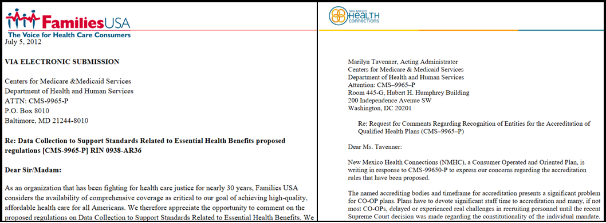 | 
|:--:| 
| *The attachments associated with two comments posted to the same document at the same time. This suggests that these criteria are not enough to identify automated comments.* |

 

| 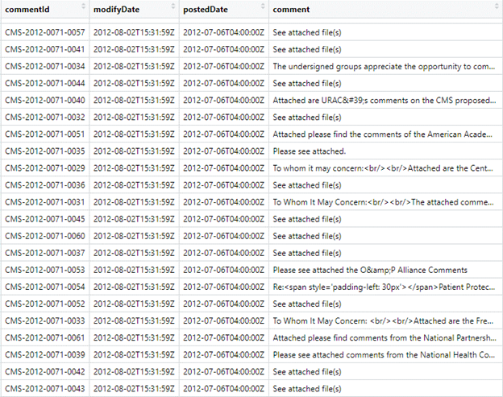 | 
|:--:| 
| *The table above shows many comments posted to [the same document](https://www.regulations.gov/document/CMS-2012-0071-0001) at the exact same time.* |

---
## Comment similarity

Form letter comments are often identical, but not always: see, for example, [1](https://www.regulations.gov/comment/FMCSA-2017-0297-0278) and [2](https://www.regulations.gov/comment/FMCSA-2017-0297-0849). The same text may be altered in many small and large ways: 

1. A user might add a few words, like "please", "thank you", or "to whom it may concern". See [1](https://www.regulations.gov/comment/FWS-R3-ES-2011-0029-0467) and [2](https://www.regulations.gov/comment/FWS-R3-ES-2011-0029-0486).
2. A user might make typos when they copy and paste the text into the comment box. See [1](https://www.regulations.gov/comment/OPM-2019-0004-0475) and [2](https://www.regulations.gov/comment/OPM-2019-0004-0531).
3. A commenter's computer might alter the formatting, such as by using number bullets instead of dot bullets, or inserting "smart quotes" (&#8220; and &#8221;) instead of straight quotes. See [1](https://www.regulations.gov/comment/NOAA-NMFS-2013-0029-0610) and [2](https://www.regulations.gov/comment/NOAA-NMFS-2013-0029-0626).
4. Someone might slightly rephrase things, include their professional affiliation or title, or add some details that are important to them. See [1](https://www.regulations.gov/comment/FWS-R5-ES-2013-0097-0600) and [2](https://www.regulations.gov/comment/FWS-R5-ES-2013-0097-0588).
5. In some cases, a commenter may start with a "prompt", that is, a series of points that the organizers want the commenter to include in their letter. See [1](https://www.regulations.gov/comment/CMS-2016-0116-3351) and [2](https://www.regulations.gov/comment/CMS-2016-0116-4499).

Ways 1-3 are not too difficult to detect. Way 4 is a little more challenging. Way 5 would be much more difficult to detect, and it is debatable whether that kind of comment should be treated as a form letter comment or not. For this reason, I would divide documents into four categories:

1. Duplicate (form letter)
2. Near-duplicate (form letter)
3. Prompt-driven, i.e., given main ideas to write about (possibly form letter?)
4. Not a form letter

### Cosine similarity

One of the most common ways to assess document similarity is using [cosine similarity](https://en.wikipedia.org/wiki/Cosine_similarity). Starting with the DFM matrix for the non-attached comments, I computed the TF-IDF matrix to downweight words that were common in all comments in the dataset (such as "proposed", "rule", and "regulation") and upweight less common words. Then I attempted to calculate the cosine similarity between every pair of comments in the dataset. This failed due to a lack of memory: with over 105,000 comments, the number of cosine similarity calculations was over 10 billion. Using 32 bits per floating-point value, that amounts to over 322 GB, not accounting for the overhead of storing these data in an R data structure. I wouldn't have even been able to store this on disk.

My solution was, as with the comment download process, sampling! My idea was to randomly re-sample 1,000 rows at a time (with replacement), calculate their similarities, and output them to a file. This would avoid the memory issue, as I would only have to hold 10002 = 1,000,000 similarities in memory at one time. I repeated this re-sampling 105 times to align with the nearly 105,000 non-attached comments in the dataset, though this is not meant to imply that I calculated the same number of comparisons as if I had used all ~105,000 comments at once. In fact, I only end up with about 105,000,000 comment comparisons out of over 10,000,000,000 (9.5%, to be exact). This also includes many duplicates due to sampling with replacement. Once duplicate comparisons and "identity" comparisons (comparing a comment to itself) were removed, I was left with 34,973,660 comparisons (0.3% of all possible comparisons!). That said, I believe this does cover much of the heterogeneity I would expect in the dataset and should be sufficient to understand the general patterns of similarity in the dataset.

The plot below shows the distribution of comment similarities in this sampled dataset. The overall median similarity (on a scale of 0 to 1) was 0.01, with an interquartile range of 0.0051 to 0.019. About 15,665 comparisons had a similarity equal to exactly 1.0, and another 4,782 comparisons had a similarity greater than 0.9. Thus, it is safe to conclude that there is very little similarity between any two random comments in the dataset.

 

| 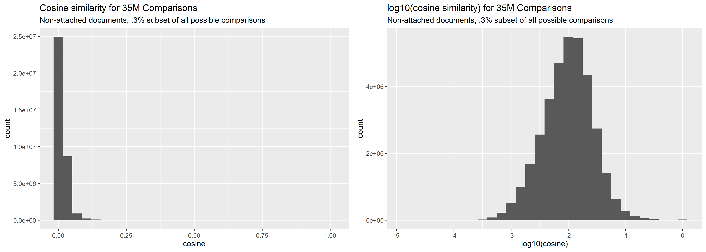 | 
|:--:| 
| *Distribution of comment similarities for a sampling of possible comparisons in the non-attached comments corpus. The plot on the right shows the data with a log-transformed x-axis. The median similarity was 0.01.* |

 

The next two charts show the distribution of cosine similarities for comments from two schools, within two separate documents. The first shows comments from a 7th grade life sciences class at [Princess Anne Middle School](https://douglas-r-rice.github.io/jobs/2021/03/14/3-jobs.html#princess-anne-middle-school) writing in response to a [proposed change](https://www.regulations.gov/document/FWS-R5-ES-2014-0021-0002) to the Endangered Species Act. The second shows comments from a college class at Murray State University writing in response to a [change to an OSHA regulation](https://www.regulations.gov/document/OSHA-2007-0066-0540). In both cases we can see that the distribution of similarities is much larger than we see among comments in general. This makes sense for two reasons: (1) we expect comments on the same topic to be more similar, and (2) we would expect a more homogeneous group (especially a school class) to use similar language because they are motivated in the same way, such as by a teacher's prompt. Especially interesting is the fact that the 7th grade students' comments tend to be significantly more similar than the college students' comments (median similarity 0.315 vs. 0.165; **t-test p-value < 10-10**). This makes some sense if we believe that younger students are more likely to write formulaic five-paragraph structured essays that closely follow the prompt.

 

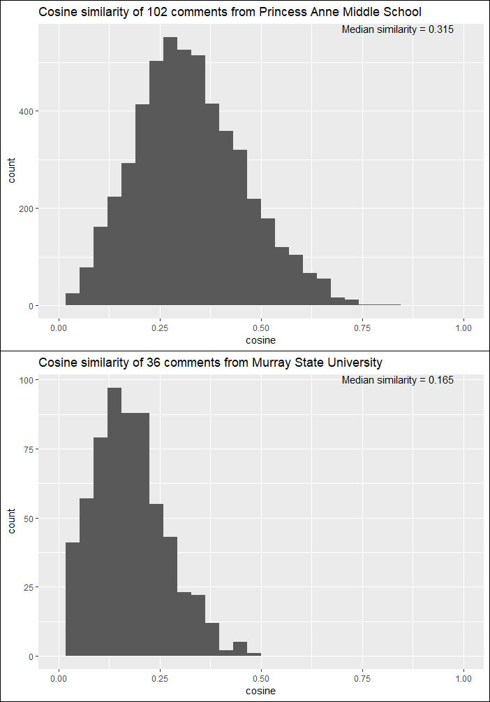

 

The two most-similar comments from each of these schools are shown in the table below with their similarity. Note that the comments from the middle school students have several typos.

 

|     School                  |     Comment 1                                                                                                                                                                                                                                                                                                                     |     Comment 2    |     Similarity                                                                                                                                                         |
|---------------------------------|--------------------------------------------------------------------------------------------------------------------------------------------------------------------------------------------------------------------------------------------------------------------------------------------------------------------------------------|-----------------|---------------------------------------------------------------------------------------------------------------------------------------------------------------------------|
|     Princess Anne Middle School |     "Dear Fish and Wildlife service, We are students of Princess Anne Middle School, lately in life science we have been studying the Delmarva Peninsula fox squirrel. My peers and I would like to give you our opinion on the Delmarva fox squirrel being on or off the endangered species list. Personally, we think the Delmarva fox squirrel should stay on the list, so the public will take care of the species. The Delmarva fox squirrel should be in a safe habitat, so people won't hunt it or take their habitats. They also need to be cared about, and not just left in the wild without being watched and cared for. Finally, if the Delmarva fox squirrel stays on the list scientist will study them, and learn more about the species. Thank you for taking the time and considering our statment on the Delmarva fox squirrel."                                                                                               |     "We are seventh grade students at Princess Anne Middle School. We believe that the Delmarva Fox Squirrel should be left on the endangered species list. The Delmarva Fox Squirrel is in need of protection. We believe that the species is not safe in it's own enviornment. The Delmarva Fox Squirrel is being harmed by unleashed dogs and other predators. Humans are harming the Delmarva Fox Squirrel by cutting down their habitats to make paper. Global warming is also effecting the population Delmarva Fox Squirrel. The population will continue to decrease and the species will become extinct if nothing is done about the siutuation. If the Delmarva Fox Squirrels do become extinct then the food chain will be affected in negative ways." |     Cosine similarity = 0.81 |
|     Murray State University     |     "Extending the deadline to meet compliance requirements for operators on cranes and derricks in construction to 2018 proves to be a risky idea. As outlined by the cost comparison already carried out by OSHA, it is more than twice as expensive to extend the deadline. Also, having crane and/or derrick operators that are not certified working on job sites is a hazard. This particular deadline has already been given one extension and is not deserving of another. Continuing to allow such operators access to a work site puts many lives in imminent danger. The certifying bodies that operators may seek out have been clearly identified by OSHA. Industries utilizing this technology have already had an extension of three years to accomplish this task. It should have been feasible for the majority of employers to have their crane operators become certified as these programs are typically a two day process." |     "I believe that extending the deadline to meet compliance requirements to 2018 would be detrimental to the safety and health of employees working with cranes and derricks. This proposal has already been delayed once and can only lead to negative outcomes if delayed again. Crane and derrick operators need crucial training for working their equipment. Extending the deadline also proves to be more expensive. This has already had a three year extension and has no right in being delayed any longer. Uncertified operators are a high risk situation on the work-site."                                                                                                                                                                         |     Cosine similarity = 0.47 |

 

The table below shows a few comments with very high similarity (> 0.99) because the author only changed a few words (highlighted in yellow, if GitHub markdown allows it).

 

| Similarity | Comment 1                                                                                                                                                                                                                                                                                                                                                                                                                                                                                                                                                        | Comment 2                                                                                                                                                                                                                                                                                                                                                                                                                                                                                                                                                        |
|------------|------------------------------------------------------------------------------------------------------------------------------------------------------------------------------------------------------------------------------------------------------------------------------------------------------------------------------------------------------------------------------------------------------------------------------------------------------------------------------------------------------------------------------------------------------------------|------------------------------------------------------------------------------------------------------------------------------------------------------------------------------------------------------------------------------------------------------------------------------------------------------------------------------------------------------------------------------------------------------------------------------------------------------------------------------------------------------------------------------------------------------------------|
| 0.996      | "Do not delist the eastern Steller sea lions, which could jeopardize them as well as the..."                                                                                                                                                                                                                                                                                                                                                                                                                                                                     | "Please do not delist the eastern Steller sea lions, which could jeopardize them as well as the..."                                                                                                                                                                                                                                                                                                                                                                                                                 |
| 0.998      | "The final Organic Livestock and Poultry Practices rule was the product of years of inclusive deliberation on the part of farmers, consumers, retailers and policy makers. The final rule evens the playing field for farmers, brings the organic standards in line with consumer expectations, and will improve the lives of some 50 million animals each year. Any effort to derail this rule sends a clear message that USDA is willing to abandon consumers and farmers to support Big Ag."                                                                  | "The final Organic Livestock and Poultry Practices rule was the product of years of inclusive deliberation on the part of farmers, consumers, retailers and policy makers. The final rule evens the playing field for farmers, brings the organic standards in line with consumer expectations, and will improve the lives of some 50 million animals each year. Any effort to derail this rule sends a clear message that USDA is willing to abandon consumers and farmers to support Big Ag. I SUPPORT THE RULE!" |
| 0.991      | "I urge the Small Business Administration not to finalize this rule. I urge the SBA to instead redirect federal funding away from corporate animal agribusiness.  The proliferation of corporate-controlled concentrated animal feeding operations that cruelly confine billions of animals is polluting our air and water, threatening public health, and putting rural communities at risk.  The Small Business Administration should be supporting small businessnot propping up corporate animal agribusiness." | "I urge the Small Business Administration not to finalize this rule and to instead redirect federal funding away from corporate animal agribusiness. The proliferation of corporate-controlled concentrated animal feeding operations that cruelly confine billions of animals is polluting our air and water, threatening public health, and putting rural communities at risk. The Small Business Administration should be supporting small businessnot propping up corporate animal agribusiness."               |

 

Out of curiosity, I thought it might be interesting to see the similarity of comments submitted by [frequent commenters](https://douglas-r-rice.github.io/jobs/2021/03/14/3-jobs.html#frequent-submitters) (as identified by their name or organization). The image below shows this, sorted in order of the median cosine similarity across each individual's/organization's comments. This suggests that there is a wide range of similarities of commenters, likely because they comment on an array of issues.

 

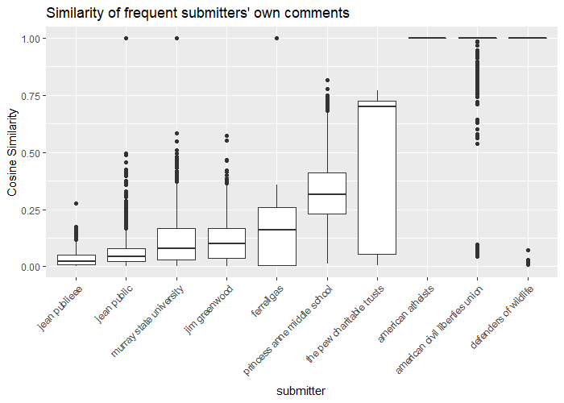

 

As another idea, I examined the similarity of comments by agency. Perhaps dividing comments along these lines would boost the overall similarity somewhat? Given the image below, it seems like there may be a small, non-negligible boost in similarity from 0.01 in the corpus overall.

 

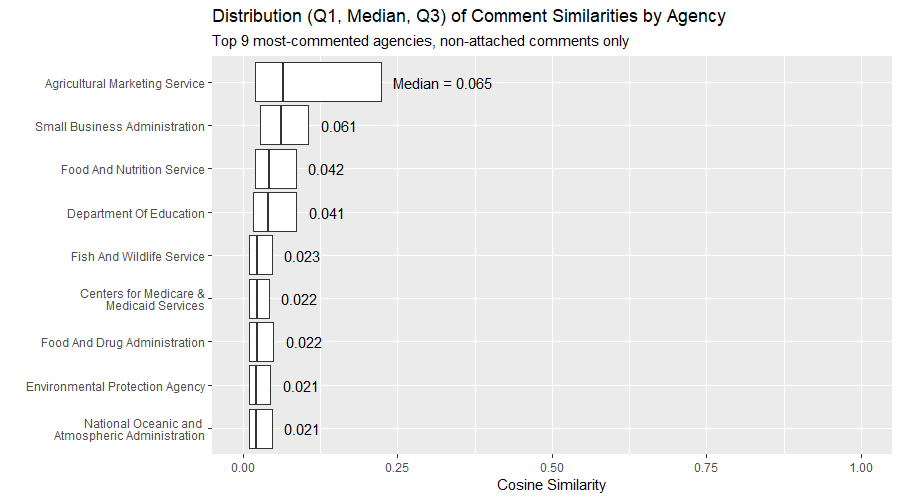

 

I also examined a scatterplot of the median cosine similarity for each agency vs. whether there was any trend between the number of comments an agency received and the median cosine similarity for that agency. I found that agencies that received a large number of comments tended to have lower median cosine similarity across their comment corpus, and agencies with a very small number of comments tend to have higher median cosine similarity, but the relationship (if it truly exists) is highly nonlinear.

 

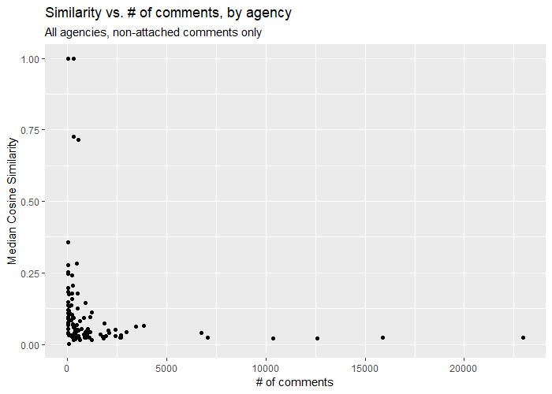

 

Finally, I compared the similarity of comments within a given document to the similarity of comments from other documents. Accomplishing the former was easy: I looped over each document, created the TFIDF DFM matrix, and calculated the cosine similarity for each pair of comments. This allowed me to then compare the mean similarity, variance of similarities, etc., across all documents in the dataset; see the plot below.

 

| 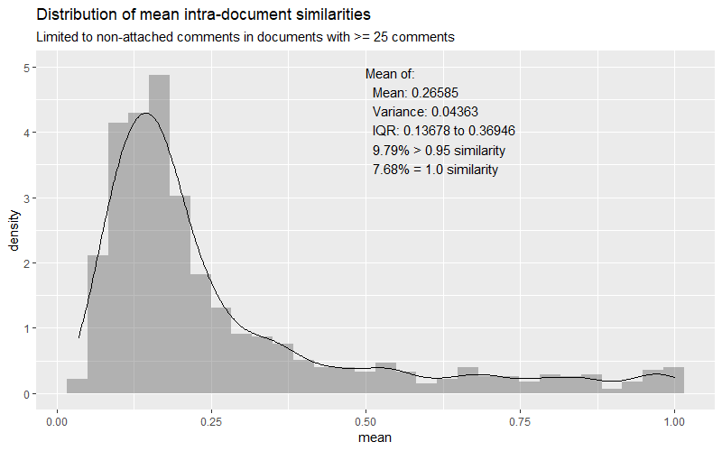 | 
|:--:| 
| *Distribution of mean comment similarity in each document in the non-attached document corpus, for documents with at least 25 comments. The similarities were calculated within each document and the mean, variance, IQR, and proportion with a similarity greater than 0.95 or equal to 1.0 were calculated for each document separately. The plot shows the distribution of these means, and the textbox summarizes the mean of these means, the mean of these variances, etc.* |

 

To estimate the expected similarity of comments not within the same document, I sampled one non-attached comment from each of the 1,212 comments in the corpus, calculated the similarity between each pair of these comments, and saved the mean, variance, IQR, and fraction with similarity greater than 0.95 or equal to 1.0. I repeated this for a total of 200 repetitions. In essence, I created 200 pseudo-documents consisting of 1,212 comments pulled from different *actual* documents and did the same procedure as for the intra-document similarities above. The resulting distribution is shown below. Note that the distribution is shifted much closer to zero, with a mean of the means equal to about 0.015, which is close to our estimate of 0.01 from earlier. This small similarity for comments not from within the same document matches our expectations.

 

| 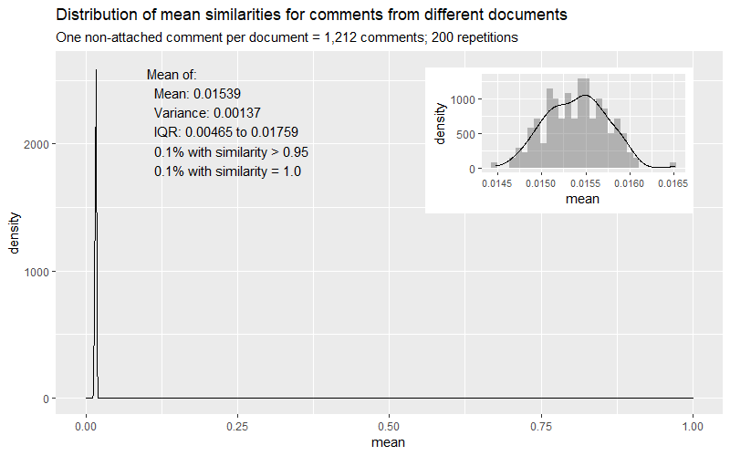 | 
|:--:| 
| *Distribution of mean comment similarity for comments from different documents, based on a simulation that selected one comment from each of the 1,212 documents, calculated the similarity, and repeated for a total of 200 repetitions.* |

 

Overall, comment similarity seems a good, though not perfect, way of identifying form letter comments. It does very well with comments that are clearly form letters, but I have observed some comments that are form letters with similarities between 0.7 and 0.8. For example, [this comment](https://www.regulations.gov/comment/EPA-HQ-OA-2018-0259-8948) and [this comment](https://www.regulations.gov/comment/EPA-HQ-OA-2018-0259-8959) have a cosine similarity of 0.7. The comments are largely identical, except for some short personal additions at the bottom. Similarly, these two comments ([1](https://www.regulations.gov/comment/FWS-R9-ES-2010-0086-0580) and [2](https://www.regulations.gov/comment/FWS-R9-ES-2010-0086-0746)) have a cosine similarity of 0.702. While the second is much longer than the first, they both include exactly the same paragraph of text, suggesting the second commenter added additional information on their own. As a result, I believe that cosine similarity can be incorporated into a successful strategy for form letter identification, but isn't sufficient on its own.

### Additional measures of similarity
This led me to pursue additional measures of similarity that could supplement cosine similarity. The simplest such metric is edit distance. While there are [various ways](https://en.wikipedia.org/wiki/Edit_distance) of calculating the edit distance between two documents, they basically amount to counting the number of characters needed to add, remove, or replace to change one string into another. A smaller edit distance means that two strings are closer to an exact match. I used the "OSA" method in the `stringdist` library in R, which is a restricted version of the Damerau-Levenshtein distance that is quicker to calculate. In addition, I used the Python library `pylcs` to calculate the longest common substring (LCS) between two strings, which does what it sounds like. 

These two measures are computationally intensive. When I tried calculating these measures for each pair of comments in every document, after running 8 hours it had only finished 66 documents. After trying a few different things, I realized the only surefire way to speed up the process would be to limit the portion of the comment being analyzed because the runtime-complexity of both algorithms is `O(m*n)` (`m` is the length of comment 1, `n` is the length of comment 2) (see [1](https://en.wikipedia.org/wiki/Edit_distance#Computation) and [2](https://www.geeksforgeeks.org/longest-common-substring-dp-29/)). Therefore, for the edit distance and LCS computations, I limited their work to the first 250 characters of each comment. This is a reasonably large amount of text, and if the first 250 characters in two comments are the same, it is believable that the comments are from a form letter. (As before, this isn't sufficient to find all form letters, however; there may be form letters where the commenter pre-pended the form letter with content of their own, or the form letter may be prompt-driven).

Given these three measures (cosine similarity, edit distance, and LCS) for each pair of comments in each document, I could re-group the data at the comment-level, assigning to each document the maximum cosine similarity, the minimum edit distance, and the maximum LCS with any other comment in that document. For example, in the following situation:

* (comment A, comment B) = 0.7 similarity
* (comment A, comment C) = 0.6 similarity
* (comment B, comment C) = 0.8 similarity

I would assign a max cosine similarity of 0.7 to comment A and 0.8 to comments B and C. This helpfully compacts the large amount of pairwise comparisons, allowing me to use these new summarized metrics in a model in the future. The image below shows these "peak" within-document comment similarities, limited to documents with more than one comment, comments with less than 1.0 similarity, and comments with a length greater than 0. Interestingly, the distribution of the maximum cosine similarities is bimodal, with a large peak near the overall intra-document mean we observed before and another spike close to 1.0, likely associated with form letter comments. The longest common substring has most of its mass between 0 and 50 characters, with a spike at 250 characters, which was the maximum length of a comment the algorithm was allowed to see. The edit distance shows a spike near 0 characters, likely for duplicate comments and comments that are highly similar.

 

| 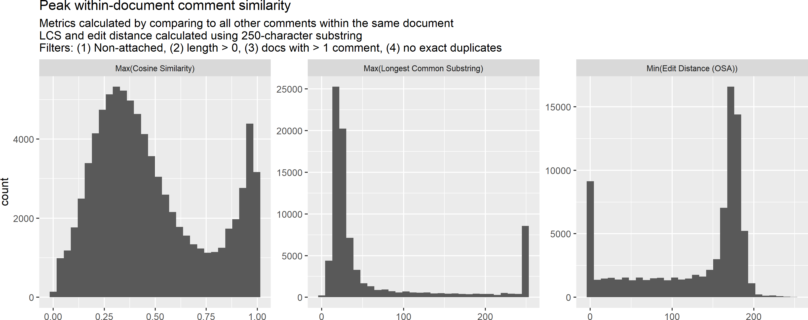 | 
|:--:| 
| *Distribution of summarized within-document similarity measures for non-attached comments. Each comment was assigned its highest cosine similarity (with any other comment), its largest LCS (with any other comment), and its minimum edit distance (with any other comment).* |

 

The relationship between maximum cosine similarity and minimum edit distance is shown below. It appears that edit distances near zero are clustered closer to a cosine similarity of 1.0, but that there is also a pocked near cosine similarity of 0. These are likely comments that are very short and which have different words. The largest amount of comments have a cosine similarity between 0.125 and 0.625, and an edit distance between 150 and 200.

 

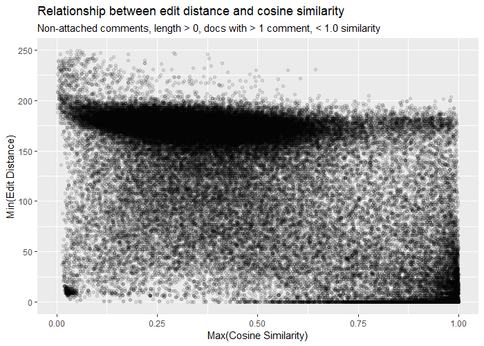

 

It is worth noting that it is possible to have a very large edit distance and high similarity at the same time. For example, two prompt-driven comments about the same topic and which use the same specialized language (e.g., about osteopathic medicine) might have very high similarity scores owing to the TFIDF weighting of their use of infrequent words (vs. the entire corpus), but also have high edit distances if the comments are long and written in the authors' own words. See, for example, the two comments shown below, which have a cosine similarity of 0.927 and an edit distance of 1,644.

 

| 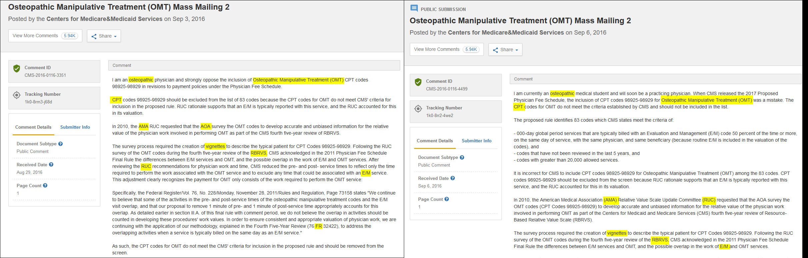 | 
|:--:| 
| *Example of two comments with a high cosine similarity (0.927) and also a high edit distance (1,644). These comments use highly specialized language related to osteopathic medicine and they appear to be prompt-driven comments, so they use unique phrases but common terms. The specialized terms that they have in common are highlighted in yellow.* |

 

---
## Where next?

Now I have a set of around 83,000 comments with several variables that could be used to train a model to detect form letter comments. I intend to manually label a large number of comments, targeting comments with high similarity especially and looking across agencies. I will ideally aim for a balanced dataset (or at least not too imbalanced). The variables I have prepared for this model are, for each comment:

* max cosine similarity (to any other comment in the same document)
* min edit distance (to any other comment in the same document)
* max longest common substring (LCS) (to any other comment in the same document), and max LCS normalized to the length of the comment
* federal agency associated with the document
* year the document was posted
* length of the comment, in characters
* count of comments submitted in response to the comment's document
* number and percent of comments in the comment's document with a similarity score greater than 0.9

Before building the model, I may want to update my data pipeline to handle some issues I have discovered along the way, such as comments with no characters, documents with too few comments, and excluding exact duplicates from the modeling process. I may also try to treat comments that just say "Comment on [...]" as "attached" comments.

---
## Bonus: bots!

As I described in the [first post](https://douglas-r-rice.github.io/jobs/firstpost/2021/02/14/1-jobs.html#web-interface), there may be comments that have been posted by bots, either for benign or malicious reasons (such as trying to manipulate the overall sentiment on a given document by flooding the comments). Until recently, I had not stumbled on any definitive evidence of comments submitted by bots, but I believe I finally found some. In the comments associated with [this document](https://www.regulations.gov/document/OCC-2020-0024-0001/) there are a variety of comments submitted by "Anonymous [##]", in all capital letters and with nonsense English words. They often have attachments which contain a lot of HTML tags and formatting. Altogether, this seems like bots running amok.

 

| 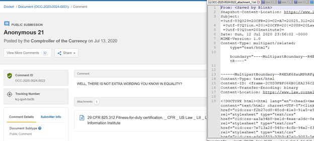 | 
|:--:| 
| *[This comment](https://www.regulations.gov/comment/OCC-2020-0024-0022) is one example of several comments submitted to [one document](https://www.regulations.gov/document/OCC-2020-0024-0001/) which all look suspicious. The text in the comment is in all capital letters, seems nonsensical and irrelevant, and the attachments are full of plain-text and code.* |

 

| 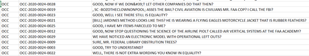 | 
|:--:| 
| *Examples of the text associated with comments that appear to have been submitted by bots.* |

 

