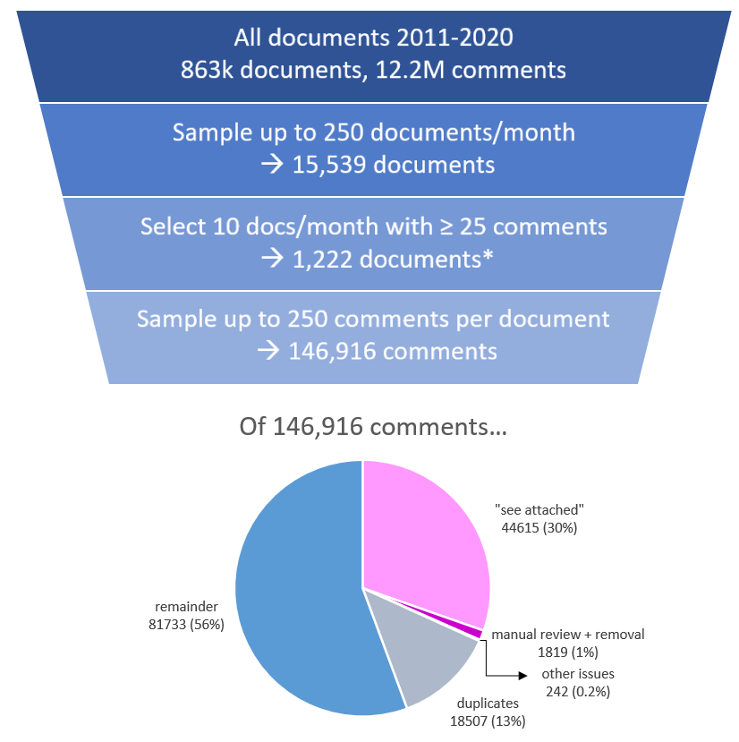
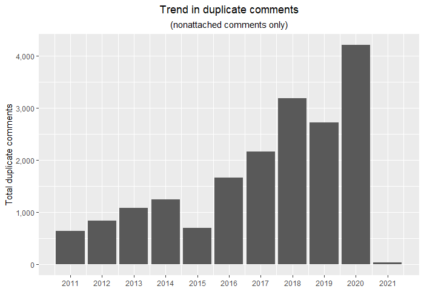
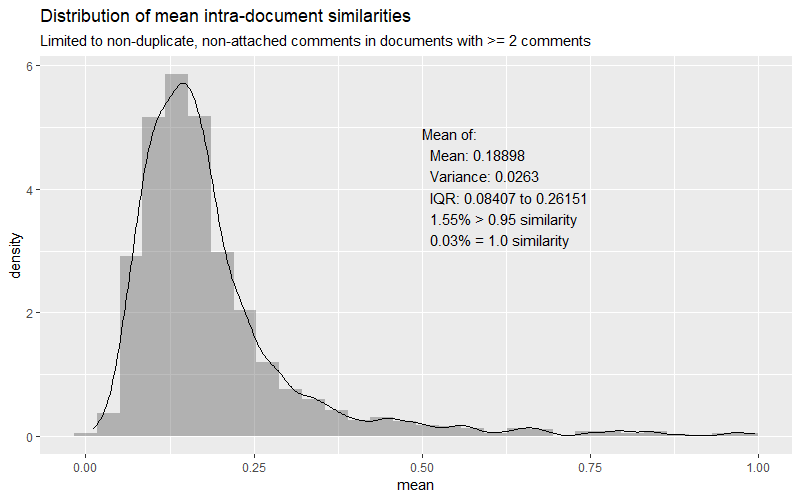
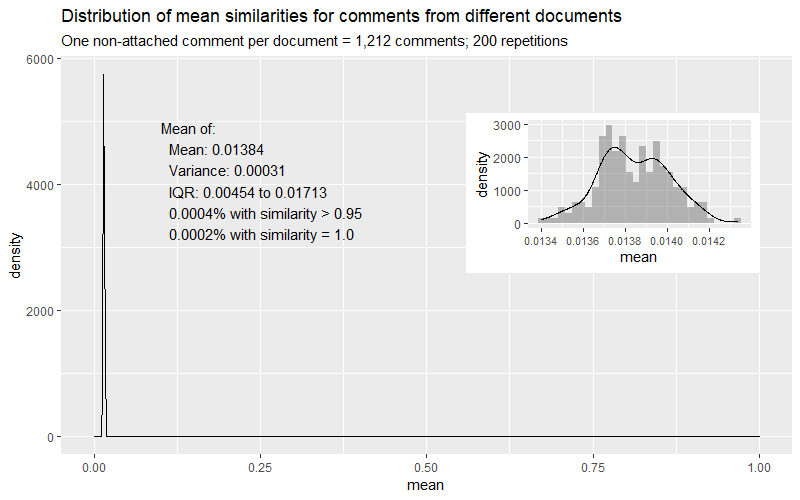
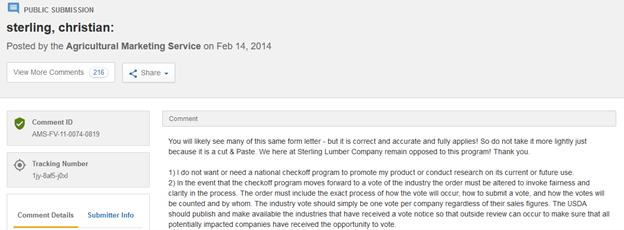
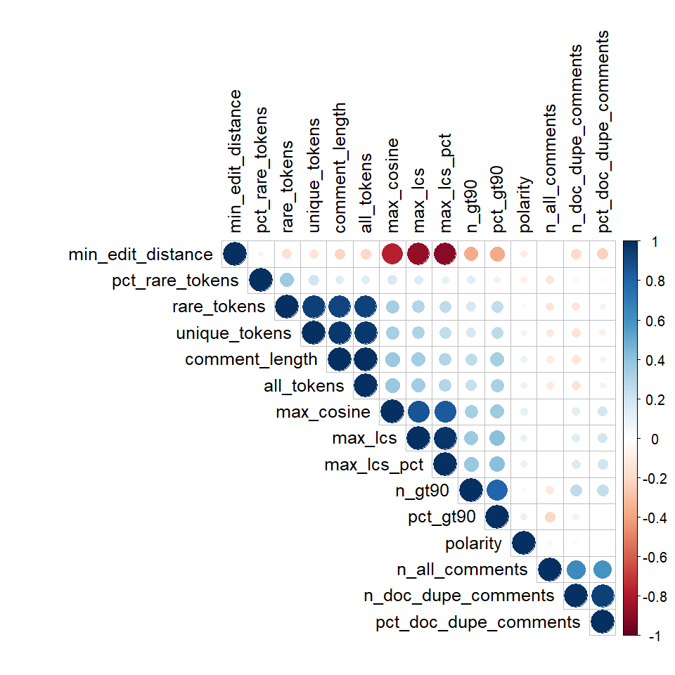

# Form Letter Identification via Supervised Learning (Jobs)

This post details my efforts to build a model to classify public comments from [Regulations.gov](https://www.regulations.gov) as either a "form letter" or not. The models are based on the work conducted in [the last post](https://douglas-r-rice.github.io/jobs/2021/03/28/4-jobs.html), particularly the section on [measuring comment similarity](https://douglas-r-rice.github.io/jobs/2021/03/28/4-jobs.html#similarity). The goal of this work is to build a system that can separate comments written by individuals from groups using pre-written scripts used to swamp the public comment system without adding any new information other than quantity of comments. 

[As I discussed in my first post](https://douglas-r-rice.github.io/jobs/firstpost/2021/02/14/1-jobs.html#web), Regulations.gov makes no effort to verify that an individual or organization is who they say they are, does not limit users from making multiple comments, and in fact suports automated submission of batches of comments. For these reasons, a large quantity of comments with the same message is not necessarily meaningful to federal agencies. In addition, as I described, the submission form instructions state that form letters **"do not constitute a 'vote'"** and that **"a single, well-supported comment may carry more weight than a thousand form letters."** Therefore, a way to identify (and ideally, cluster) form letters would be helpful to any agency reviewing a document that receives hundreds or thousands of comments.

---
## Contents
* <a href="#pipeline">Re-visiting the data pipeline</a>
* <a href="#graphics">Re-creating important graphics</a>
* <a href="#hand-labeling">Hand-labeling</a>
* <a href="#model-building">Building supervised models</a>
    * <a href="#logistic">Logistic regression</a>
    * <a href="#forest">Random forests</a>
* <a href="#analysis">Post-model analysis</a>
* <a href="#bonus">Bonus: a song and a play!</a>
---
## Re-visiting the data pipeline

As I continued working with the data, I encountered some issues that made me decide to re-visit the process I used to take my data from raw, downloaded comments to a pristine dataset that was ready for analysis. The most pressing issue seemed to be that my filter for ["attached" comments](https://douglas-r-rice.github.io/jobs/2021/03/14/3-jobs.html#attached) seemed too conservative; there were many comments that clearly indicated the substance of the comment was included in an attachment, but which did not use any variation of the word "attachment". I encountered many such patterns, like "comments enclosed", "I am submitting", "I have uploaded", "please accept this", "comment on [document ID]", and "[FirstName LastName]'s comment". By examining comments with lengths less than 200 characters, I was able to identify 16 patterns that I could use to identify these comments. These patterns (and the length limit of 200 characters) produced a list of 2,753 comments that I manually reviewed to confirm that they were indeed "attached" comments. Of these, 2,489 comments were added to my previous list of 42,126 attached comments, giving a total of 44,615 attached comments.

This wasn't the only issue, however. I also encountered some non-ASCII characters that I feared would affect the downstream analyses, e.g., by introducing rare terms into the document-feature matrix. These characters can sometimes be introduced when someone copies and pastes from a program that adds extra formatting (e.g., curly quotes in Microsoft Word) or when data is loaded with a different text encoding than what is expected (e.g., [UTF-8](https://en.wikipedia.org/wiki/UTF-8) instead of [Windows-1252](https://en.wikipedia.org/wiki/Windows-1252)). While reading over my colleagues' posts, I saw that [Larri had used](https://douglas-r-rice.github.io/miller/2021/03/28/4-miller.html) the `iconv` function for just this purpose, so I used it as well, replacing any non-ASCII characters with an empty string.

Finally, I also decided to manually review all comments with fewer than 50 characters. This entailed examining 3,140 comments. Comments were flagged for exclusion from analyses for a variety of reasons, including: an indication they were a "test" comment (e.g., "please ignore. sample test message", "test comment", or just "test"); some version of "N/A"; other ways of identifying "attached" comments (e.g., "(late) joanne richter comment" or "2020fbohud.pdf"); and meaningless text or symbols (e.g., "0930-aa22. 0930-aa22.", "6030", and "abc"). This review turned up another 1,819 comments to remove.

The steps above were in addition to the steps conducted previously, including filtering out comments from document with fewer than 5 comments remaining after these cleaning steps. This latter step removed 206 comments (total) from 75 documents. The final count of comments was 100,240 comments from 1,128 documents, of which 81,733 have no exact duplicates. Altogether, this is a reduction of 2,830 clean, non-duplicate comments from what was being used in the previous analyses.

The updated sampling summary is shown below.

 

---
## Re-creating important graphics

Given the not-insignificant reduction (3.3%) in comments, I aimed to reproduce all of the important graphics from the previous posts to verify that my conclusions had not changed. This also gave me a chance to get my code in one place and give my analyses another review.

The short summary is: nothing that changed affects my understanding of the data or conclusions drawn so far, and in fact the changes that did happen bolster my findings. One trend in particular that is worth highlighting is the trend in (exact) duplicate comments over time. While this trend was clear in the last version of this graphic, you can almost draw a line along the updated version:

 

 

Another small but positive change is in the distribution of mean intra-document and inter-document similarities (see distributions shown below). Recall that the inter-document comment similarities were calculated as part of a simulation, where, in each round (of 200), one comment was randomly selected from each of the 1200+ documents in the dataset and the cosine similarity was calculated between every pair before calculated the mean, variance, interquartile range, fraction of similarities that are greater than 0.95, and fraction that are greater than 1.0. The updated distribution is shown below. In the updated version, the fraction with similarity greater than 0.95 became **three orders of magnitude smaller** than previously (0.0004% vs. 0.1%), suggesting that my improved data pipeline removed comments that were superficially similar because, e.g., they simply indicated a comment was attached. This trend also held for the analysis of within-document similarity, where a smaller fraction of similarities were greater than 0.95 (1.55% now vs. 9.79% before) or 1.0 (0.03% now vs. 7.68% before). This also reduced the mean intra-document similarity from 0.266 down to 0.189.

 

 

 

---
## Hand-labeling

In order to train a supervised model to classify my comments as either a form letter or not, I needed a labeled dataset. My dataset includes public comments on documents from over 100 agencies over the course of 10 years. To get a representative dataset with comments associated with every combination of year, agency, comment length, and number of comments on a document would take a very large sample. To streamline the process, I limited the set I would annotate to documents from the [top 9 most-commented agencies](https://douglas-r-rice.github.io/jobs/2021/03/14/3-jobs.html#most-commented). I selected documents first and annotated all of the comments on those documents. I selected documents from the full date range of the corpus (2011-2020) and aimed to choose documents that varied on the dimensions of number of comments, fraction of duplicate comments, and minimum and maximum polarity. I aimed to balance the number of documents and comments over years and agencies to the extent that I could. The distribution of documents and comments across years and agencies is shown below.

| Year | # documents | # non-duplicate comments |
|------|-------------|--------------------------|
| 2011 | 141         | 2                        |
| 2012 | 118         | 4                        |
| 2013 | 184         | 2                        |
| 2014 | 251         | 2                        |
| 2015 | 184         | 4                        |
| 2016 | 129         | 2                        |
| 2017 | 176         | 3                        |
| 2018 | 171         | 3                        |
| 2019 | 122         | 3                        |
| 2020 | 217         | 4                        |

 

| Agency                                   | # documents | # non-duplicate comments |
|------------------------------------------|-------------|--------------------------|
| Agricultural Marketing Service           | 211         | 3                        |
| Centers for Medicare & Medicaid Services | 211         | 4                        |
| Department of Education                  | 176         | 4                        |
| Environmental Protection Agency          | 207         | 3                        |
| Food and Drug Administration             | 180         | 2                        |
| Food and Nutrition Service               | 168         | 3                        |
| Fish and Wildlife Service                | 217         | 4                        |
| National Oceanic and Atmos. Admin.       | 189         | 3                        |
| Small Business Administration            | 134         | 3                        |

 

The above selection resulted in 1,693 comments from 29 documents. Annotating form letters turned out to be a lot more difficult and time-consuming than identifying "attached" comments or reviewing comments that are less than 50 characters long. For [reasons I gave in the last post](https://douglas-r-rice.github.io/jobs/2021/03/28/4-jobs.html#similarity) (with examples), form letter comments can vary quite a bit. Commenters might preface or end their comments with their name, organization or affiliation, or strong feeling. They might re-word, re-arrange, or insert text into a form letter comment either to add additional information or to make the form letter seem less like a form letter (perhaps to stymie simple detection and grouping?). As a result, the process was laborious and imperfect. 

I aided by review by adding to the annotation dataset the maximum cosine similarity and maximum LCS (longest common substring) achieved by each comment, sorting the list of comments within each document in descending order of maximum similarity. This tended to put the most obvious form letter comments at the top of the list for each document, and the most obviously *not* form letter comments at the bottom. This wasn't perfect however, and likely introduced some bias into the analysis. For example, if my manual annotations were driven mainly by the maximum cosine similarity and not by my own review, or if I was less careful about finding form letter comments among the low cosine similarity comments, any model I train would be fitting to the cosine similarity, using the cosine similarity as a variable. Short of excluding this information from my annotation process and randomly rearranging comments (making the annotation process much more time-consuming and, likely, error-prone), I could not think of a better way to do this.

In addition to the time and manual effort required to do this labeling, I found some issues that aren't as clear how to handle:

* Comments that say "I [agree with/oppose/support/endorse/am against] [X]'s comments" are not adding any new information, nor are they copying another person's comment, though they are adding their voice to the same topic. Given the metrics I have, however, the text of such a statement would be highly dissimilar to the referenced comment, and there is not a clear way to link these statements to the particular comment they endorse/oppose, if it even exists in the dataset (e.g., if they're referencing comments made off-line). I decided to mark these as *not* form letters, but it is debatable.

* Comments where a person re-posted the same thing twice by accident. This is often preceded by a statement like "please disregard previous comment and use this one", "I fixed a typo", or "I posted this yesterday and don't see it here, so here it is again." In this case there will be two comments that are near-identical but which aren't the result of a form letter campaign. I marked these as form letters, but future work could try to identify and remove these "accidental duplicates".

* It was unclear what to do if a comment has a snippet or a couple snippets from a form letter campaign but is primarily new text written by the commenter. For example, [this comment](https://www.regulations.gov/comment/AMS-NOP-15-0012-55570) and [this comment](https://www.regulations.gov/comment/AMS-NOP-15-0012-54340) share a couple of identical sentences, but the latter is over twice as long as the former. In these cases I marked them both as form letters. I can also imagine a scenario where a commenter has snippets from multiple form letter campaigns. In that case it would make sense to cluster them as a form letter (I think), but it isn't clear it would belong to any one cluster.

Finally, it is worth pointing out one goal I had at the outset of this project that I now realize is not possible with this dataset. I had hoped it would be possible to assess how public sentiment has changed over time, overall and by agency. I hypothesized that some issues (or some agencies) might have become hotbeds of argument, with many commenters taking each side of debate. In fact what I've found is that the vast majority of comments *oppose* whatever it is the document is about. I tried hand-labeling some documents to identify comments that were for or against the document's stated purpose (which itself isn't always clear-cut), and in half an hour of review did not find one comment supporting the regulation change.

|  | 
|:--:| 
| *An example of a form letter comment calling itself out as a form letter!* |

---
## Building supervised models

One thing that differentiates my models from the models I've read about in my colleagues' posts is that this model is not fundamentally a text model. It uses features engineered from a text corpus, but the model itself won't be using a document-feature matrix and is low-dimensional by comparison. The reason I left the world of words, so to speak, is that I believe the task of classifying comments as form letters (or not) is actually about the relationship between comments and not the words in each comment itself. While it is possible that form letters tend to use more stilted language, for example, or have some other indicator of being a form letter that can be used isolated from other comments, more likely the relevant metric is something about a comment's "closeness" or simliarity to other comments on a given document. That said, I did include a few measures about each comment's own words in case there are signifiers like I mentioned. The variables I included at the outset of the modeling process were:

* comment-specific
    * comment length
    * total number of tokens
    * number of unique tokens
    * number of "rare" tokens, defined as tokens that are in &ge; 10 comments but < 250 comments
    * % of all tokens in the comment that are "rare"
    * emotional polarity, using the NRC dictionary's "positive" and "negative" lists
* relational
    * maximum cosine similarity ("max cosine") to any other comment in the same document
    * [minimum edit distance](https://douglas-r-rice.github.io/jobs/2021/03/28/4-jobs.html#additional-measures)
    * maximum LCS (longest common substring) with any other comment in the same document
    * maximum LCS as a fraction of the comment's length
* document-specific
    * total number of comments on the document (including those beyond my 250 comment cap)
    * number and percent of exact duplicates on the comment (among those that I collected, anyway)
    * number and percent of comments on the document with a max cosine similarity > 0.9

Note that I could not use other enticing variables, like the federal agency associated with the document or the document year because I did not sample documents from every federal agency, and have only sampled 2-4 documents from each year. A plot of the correlation among these variables is shown below, where larger, darker circles indicate larger correlation. 

 

 

### Logistic regression

### Random forests

---
## Post-model analysis

---
## Bonus: a song and a play!

